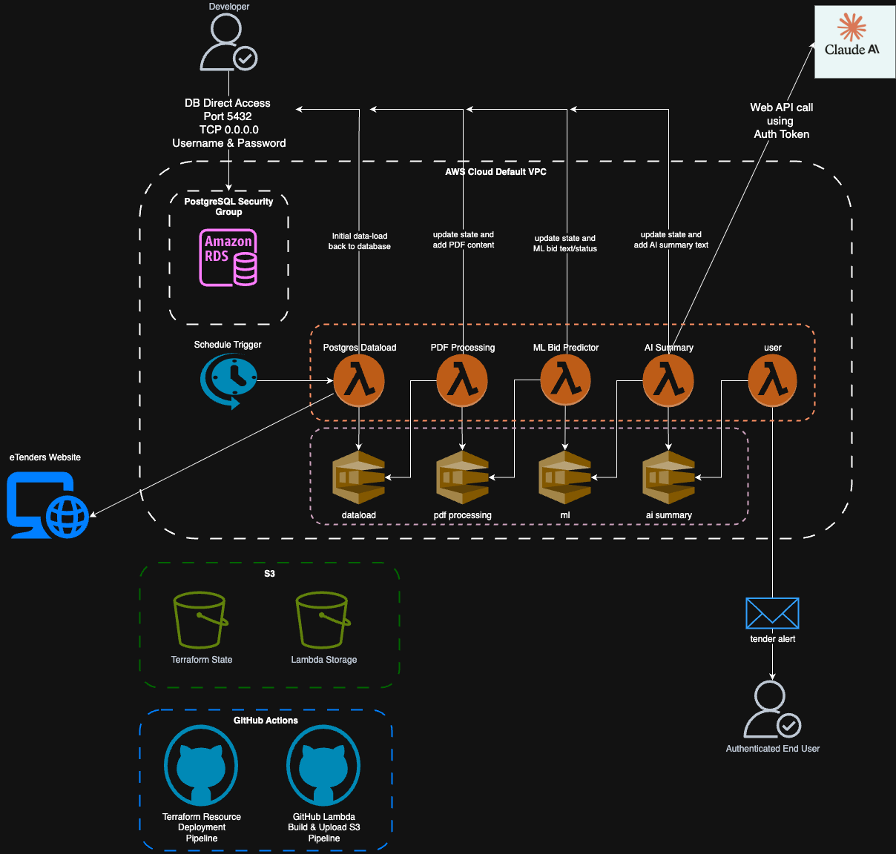
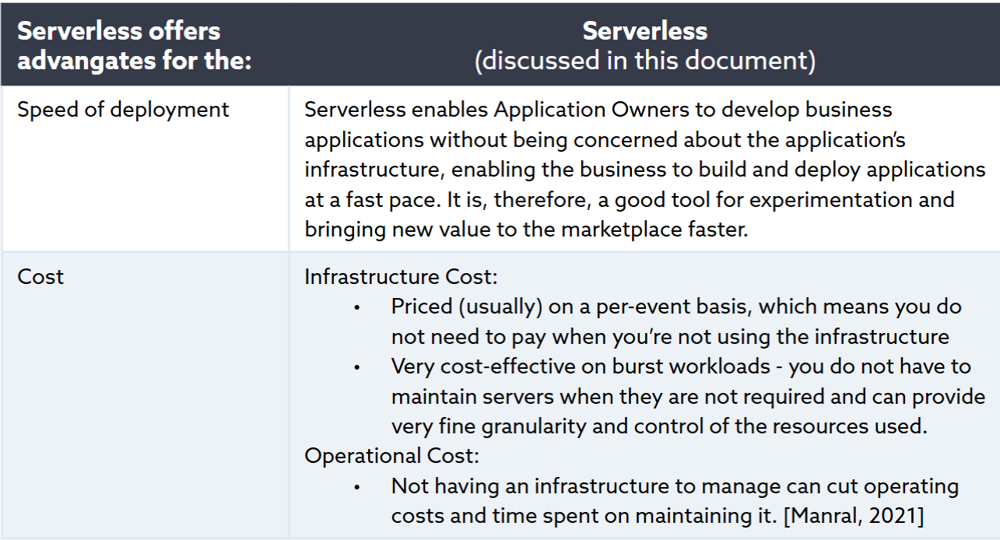
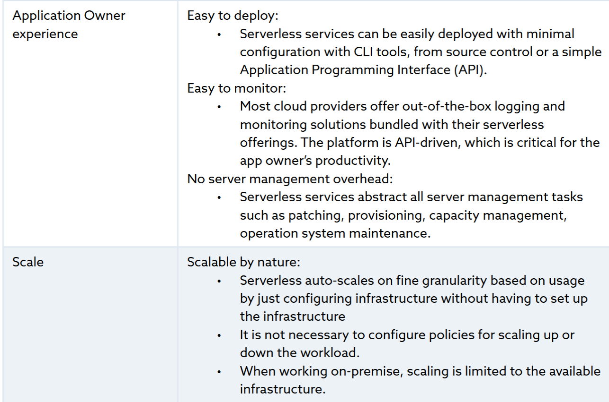
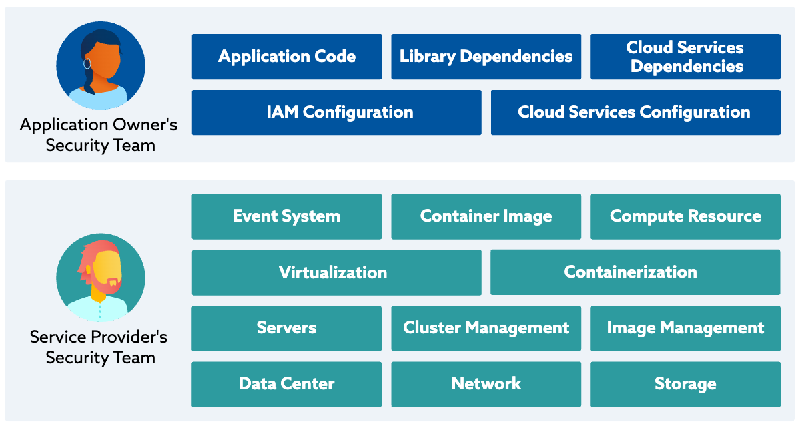
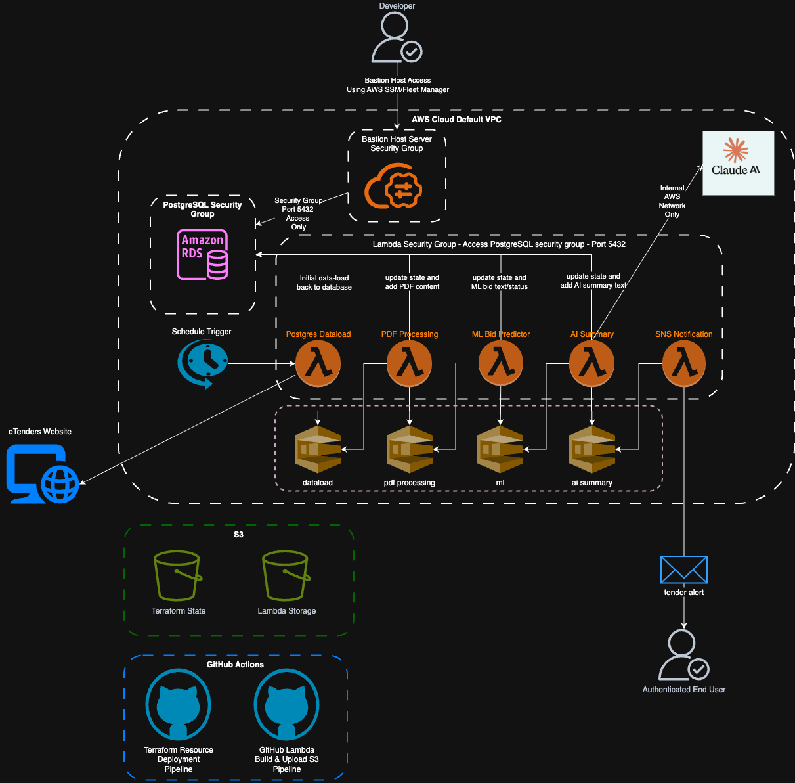
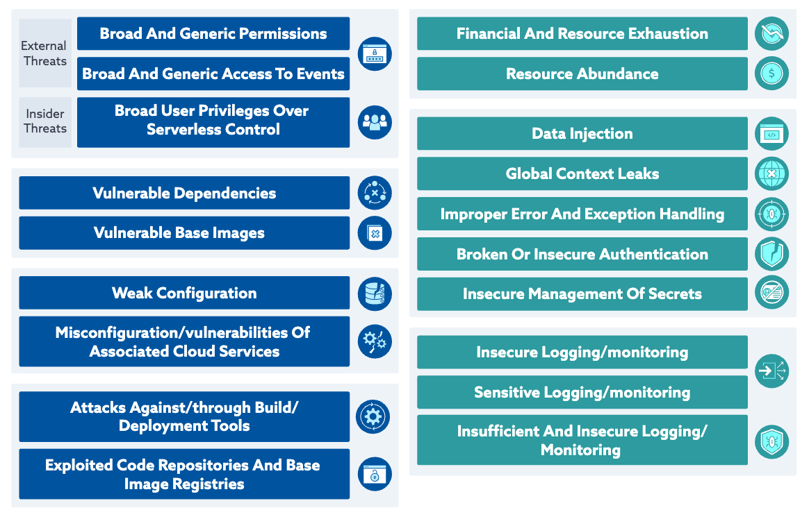
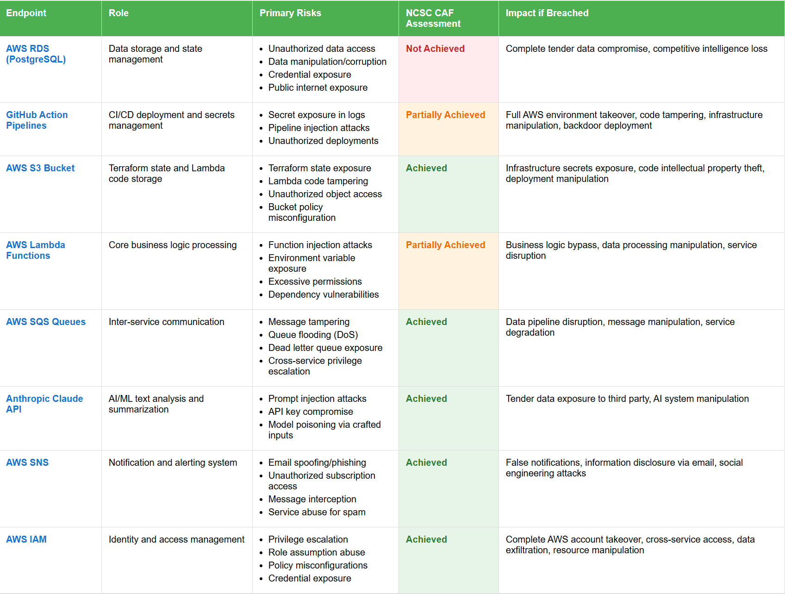
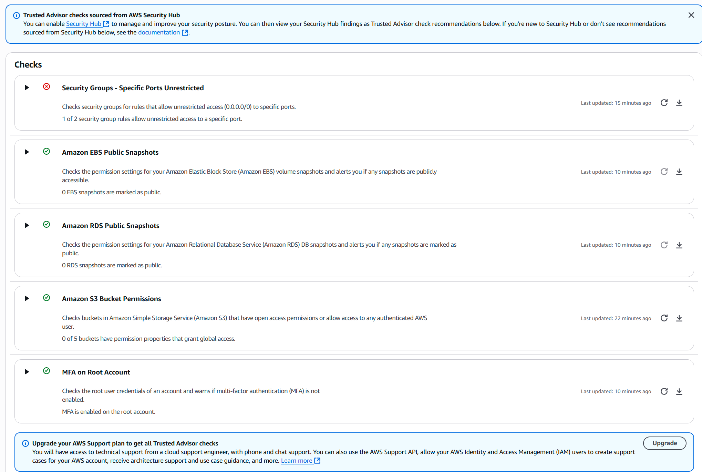
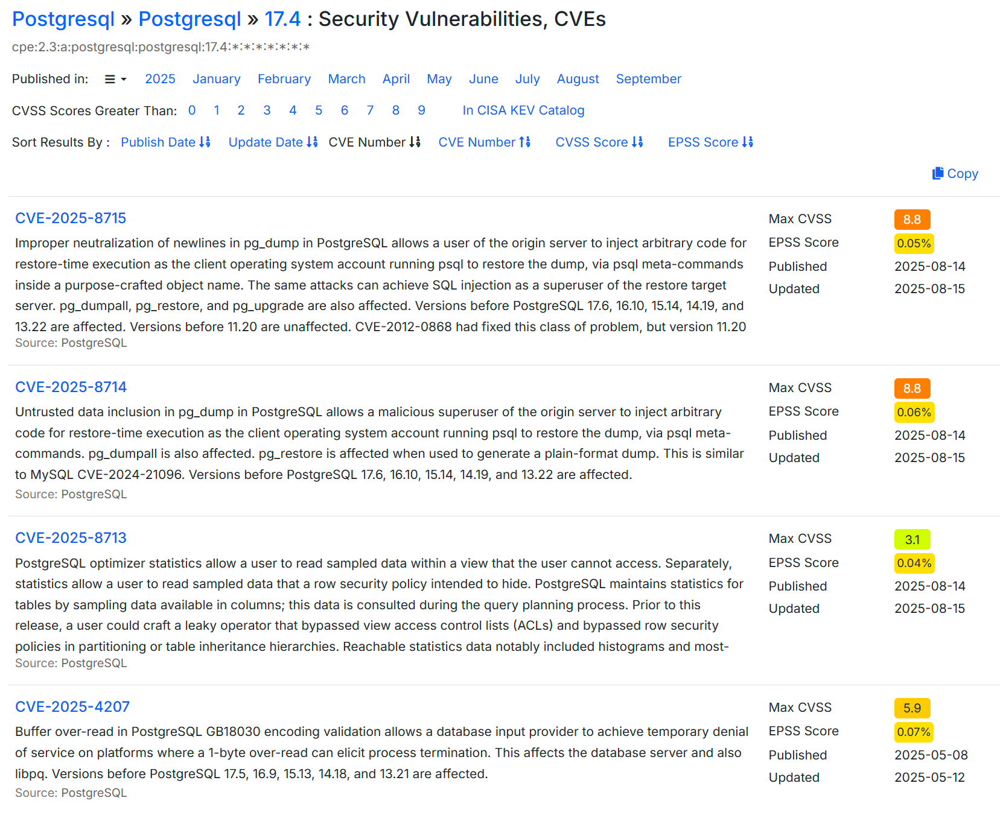

# Project 1 - Cybersecurity & Software Development

## Context

The eTenders project (robertsweetman, 2025) has allowed me to really expand my programming skills around AWS, automation, serverless functions and AI/ML. 

The project is automatically built in Amazon's cloud (AWS) and relies on a number of secret keys. As the sole developer of this application it's been my responsibility to make sure any secrets or sensitive information doesn't immediately leak because this would allow someone to create their own infrastructure for free in the root AWS account. 

If, for example the Claude API key wasn't in a GitHub secret but had been (mistakenly) included in a commit then someone would be able to use this to pose their own questions to Claude for free. Exposure of some secrets would also potentially allow a bad actor to compromise the project's AWS RDS PostgreSQL database or delete things from it even. 

The initial architecture, while developer friendly, now needs changing to enforce security best practice.

---

## K12: [Pass] Explains core technical concepts for digital and technology solutions, including: Data gathering, data management, and data analysis

### Evidence

The first serverless function `postgres_dataload` gets the latest electronic tenders and stores them in the database. 

The database is updated by subsequent functions as the tender information passes through the ML/AI pipeline. 

It also records each Lambda step to help debugging the data manipulation pipeline. 

In future it could be used to drive further ML improvements via reinforcement learning or to expand the amount of model training data.

The terraform state file is stored in S3 so multiple developers can work on the project simultaneously, rather than maintaining their own local state copy.

The S3 bucket is also where the AWS Lambdas are uploaded to when built. Each Lambda function grabs the .zip file from its bucket and runs it as part of its execution process.

---

## K16: [Pass] Explains core technical concepts for digital and technology solutions, including: Computer networking concepts

### Evidence

*Figure: Initial Application Diagram*

Our application consists of serverless functions, an event-driven chain and PostgreSQL data store/state record.

Evaluating serverless application security differs from traditional networks but their use is justified by advantages they confer, especially related to cost and maintenance.

*Figure: Serverless Advantages (Cloud Security Alliance: 2023: 10)*

Serverless architecture means developers focus on the application while everything else is abstracted away or becomes the responsibility of the cloud platform provider.

*Figure: Serverless Responsibility (Cloud Security Alliance 2023:11)*

Note that there is still _shared_ responsibility because although many vulnerabilities have been removed there are new and unique issues in serverless applications.

All the Lambda functions exist within AWS. AWS Simple Queue Service is used to trigger and initialize new function instances when a message they're interested in lands on the queue and each Lambda posts results onto the next queue in the chain.

Due to the way the Rust language is designed all the messages passed into and between the lambdas must conform to a pre-defined schema. It's not possible to inject or co-opt the messages because of this validation and data-integrity checking.

---

## S12: [Pass] Demonstrates the use of core technical concepts for digital and technology solutions, including: plans, designs and manages simple computer networks

### Evidence

*Figure: Final Application Diagram*

As can be seen in this diagram we've removed the two main external security risks, logging into the database over the open internet and sending our AI summary payload out to Anthropic's external facing API.

To help communicate the changes to a non-technical audience we can use the NCSC framework which allows us to say our proposed changes reach **Achieved** level across all requirements:

* **Database access** - Internal staff only via bastion server
* **Monitoring** - Real time alerts for application issues
* **Security scanning** - AWS config and resource issues
* **API security** - Migrate to AWS Bedrock from external API

Now the only external interaction the AWS hosted environment has is to send the "respond to this tender" message and this is only ever an outbound email. This, combined with ongoing logging & scanning results in a very secure application.

### Implementation Costs

| Item | Monthly Cost | Notes |
|------|------|-------|
| Base cost | £20 | Historical 3 month average |
| EC2 bastion server | +£15 | ($0.025 per hour x 744 hours) @ 0.75 pounds per USD (AWS, 2025) |
| Move to AWS Bedrock | £0 | Cost neutral vs. current API |
| Enhance Logging/Monitoring | +£10 | Increases data flow |
| Developer Time | estimate 1-5 hours | one off cost |

Even doubling the running cost of the app by adding a bastion server isn't nearly as damaging as suffering reputational damage.

---

## K11: [Pass] Critically evaluates the nature and scope of common vulnerabilities in digital and technology solutions

### Evidence

*Figure: Setup and Deployment Stage Threats (Cloud Security Alliance 2023:20)*

Committing secrets to code would be a "deployment stage" threat and a cloud provider wouldn't be liable for this type of mistake.

We can use the **NCSC Cyber Assessment Framework (CAF)** (NCSC, 2024) and **ISO 27001:2022**, which evaluates each endpoint against UK cybersecurity best practices.

For AI/ML we can use the **OWASP LLM Top 10** (OWASPLLMProject Admin, 2024) and **ENISA's AI Cybersecurity Guidelines** (ENISA, 2023) which cover risks in AI systems and data processing.

### Risk Assessment Matrix

The following table uses the **NCSC CAF outcome assessments** to evaluate current security:

- **Not Achieved**: Significant security gaps, immediate attention required
- **Partially Achieved**: Some controls in place but issues that need addressing
- **Achieved**: Security effectively implemented and maintained

*Figure: Risk Assessment Table*

Where endpoints are assessed as **Achieved** this is primarily through the use of 2 Factor Authentication to access AWS and GitHub.

AWS also have their own security review tooling which looks at the underlying infrastructure.

*Figure: AWS Security Review - clearly highlights PostgreSQL open port risk*

At the database level, while there _are_ vulnerabilities they are at such a low possibility of being exploited that it's not worth worrying about.

*Figure: PostgreSQL vulnerabilities*

Very low EPSS scores indicate that these exploits are unlikely to be effectively executed in the wild (FIRST — Forum of Incident Response and Security Teams, 2025).

It's often security **misconfiguration** that leads to vulnerabilities (Huntress, 2025) so automated tools (e.g. AWS Security Review) can point out common issues that might lead to data compromise.

---

## S9: [Pass] Demonstrates the use of core technical concepts for digital and technology solutions, including: security and resilience techniques

### Evidence

#### Secure the PostgreSQL database access

We can easily remove public access to the database and put the Lambdas in a security group so they can still access it but that means we restrict local developers from running queries or looking at the data themselves.

Unless we move over to AWS Aurora (which can be queried via the AWS Console UI) we have to create a bastion server to control access to the AWS environment and run a PostgreSQL client from there. These steps do immediately address the biggest issue with the application and environment security overall.

Even though the older versions of the PGAdmin client has a few CVE's there are no new ones in 2025 and not for the latest version. We can still confidently use this, especially as it will now be running _behind_ the AWS 2FA boundary.

#### Database backup

Add secure automated backups to the database settings so that if an issue occurs we can at least roll back to the last known good state.

#### Deploy additional checks as part of the GitHub Terraform deployment pipeline

We can add static code analysis tools (Trivy.dev, 2025) to the GitHub CI/CD pipeline which will check all Terraform files for vulnerabilities and misconfigurations of the resources we're building automatically in AWS.

#### Deploy additional code checks to examine GitHub commits for passwords

Automated secret scanning (Gitguardian.com, 2025) can be added because even if you delete a secret from a commit it'll remain in the git history and therefore accessible.

#### Check AWS Lambda crates for malicious code

Recently spoof emails, purportedly from the Rust Foundation, led to attempts to corrupt some Rust libraries (Rogers, 2025). Developers must make conscious checks on libraries used to build applications nowadays. Rust has mitigations - the library manifest requires packages to pin version numbers but this attack vector is definitely not a solved issue.

#### Increase and enhance AWS Lambda logging

Part of the design of a secure serverless application (Cloudsecurityalliance.org, 2023) should include comprehensive logging and monitoring.

At the moment there _are_ logs being generated by the various lambdas as part of the Rust Serverless crate but without associated alarms in AWS for errors/issues there's no notification coming back to the developer (or end user) when something goes wrong. Everything will just fail silently.

#### Subscribe to Amazon's Security Hub CSPM

This AWS tool (Amazon.com, 2025 - Introduction to AWS Security Hub CSPM) provides a more in-depth view of your ongoing security position as well as an assessment of your deployed resources against industry standards and best practices.

#### Introduce mandatory user access/event logging

Since the initial `postgres_dataload` Lambda triggers on a timer the only other serious access point is the PostgreSQL database itself. It's currently configured for access via a username & password but since it's hosted we can turn on user access logging. (Amazon.com, 2025. RDS for PostgreSQL database log files)

This depends on changing the database connection process to use AWS IAM database authentication instead but doing so means you're using connection parameters that are stored in AWS Secrets Manager, further increasing security.

---

## B4: [Pass] Commits to continuous professional development; maintaining their knowledge and skills in relation to developments in digital and technology solutions that influence their work

### Evidence

The eTenders project (robertsweetman, 2025) has allowed me to really expand my programming skills around AWS, automation, serverless functions and AI/ML.

The project is automatically built in Amazon's cloud (AWS) and relies on a number of secret keys. As the sole developer of this application it's been my responsibility to make sure any secrets or sensitive information doesn't immediately leak because this would allow someone to create their own infrastructure for free in the root AWS account.

This project required learning and applying:
- **AWS Services**: Lambda, RDS, S3, SQS, SNS, IAM
- **Infrastructure as Code**: Terraform for automated deployment
- **Rust Programming**: Building serverless functions with strong type safety
- **CI/CD Pipelines**: GitHub Actions for automated build and deployment
- **Security Frameworks**: NCSC CAF, ISO 27001:2022, OWASP LLM Top 10

We can use the **NCSC Cyber Assessment Framework (CAF)** (NCSC, 2024) and **ISO 27001:2022**, which evaluates each endpoint against UK cybersecurity best practices.

For AI/ML we can use the **OWASP LLM Top 10** (OWASPLLMProject Admin, 2024) and **ENISA's AI Cybersecurity Guidelines** (ENISA, 2023) which cover risks in AI systems and data processing.

There's also some pretty good overviews to help us with GitHub Action pipeline vulnerabilities (Singh, 2024).

---

## B7: [Pass] Maintains awareness of trends and innovations in the subject area, utilising a range of academic literature, online sources, community interaction, conference attendance and other methods which can deliver business value

### Evidence

Nowadays there's no aspect of our lives that don't rely on robust cybersecurity to protect valuable information about ourselves, our employer or our clients.

Unfortunately new technology doesn't arrive fully "battle tested" and best practices take time to become established. Results below from scanning AWS S3 buckets from 7 years ago (Rzepa, 2018):

> For 24652 scanned buckets I was able to collect files from 5241 buckets (21%) and to upload arbitrary files to 1365 buckets (6%).

Of course things will have improved but they're still not great according to Tenable (2025):

> The number of organizations with triple-threat cloud instances — "publicly exposed, critically vulnerable and highly privileged" — declined from 38% between January and June 2024 to 29% between October 2024 and March 2025.

Similarly unguarded access to Internet of Things (IoT) devices has allowed hackers to control huge "botnets", computers acting together to launch Denial Of Service attacks at targets. These botnets are often state-sponsored and designed to take opposition sites and services off-line at critical periods (Godwin, 2024).

While spending on AI (capital investment) has ballooned and its contribution to US GDP so far this year has exceeded US consumer spending (Kawa, 2025).

Cybersecurity as it relates to AI is a new field that is already challenging to keep up with. Here are some recent incidents that will no doubt keep Chief Information Security Officers awake:

* AI exfiltrating passwords from Chrome password manager (Winder, 2025)
* Enthusiastic vibe coders committing API keys to repos (Jackson, 2025)
* AI enabling a huge increase in ransomware (Winder, 2025)
* Private AI chats leaking into google search results (Arstechnica.com, 2025)

Finally, the overall picture from the Cloud Security Alliance (cloudsecurityalliance.org, 2025:13) provides a particularly uncomfortable statistic:

> More than a third of organizations with AI workloads (34%) have already experienced an AI-related breach, raising urgent questions about AI security readiness and risk management.

#### Risk vs Investment

Failure to act, especially in the case of a consultancy, means any reputational damage is likely to be significant.

Global Cyberattacks are only increasing in frequency (CheckPoint, 2024) with reputation being something that would be impacted (CYE Insights, 2024).

It only takes one decision maker hesitating on a contract award to make a £5-100 million dent in a company's revenue because reputation has a huge impact on the contract awards process and likelihood of a positive outcome.
