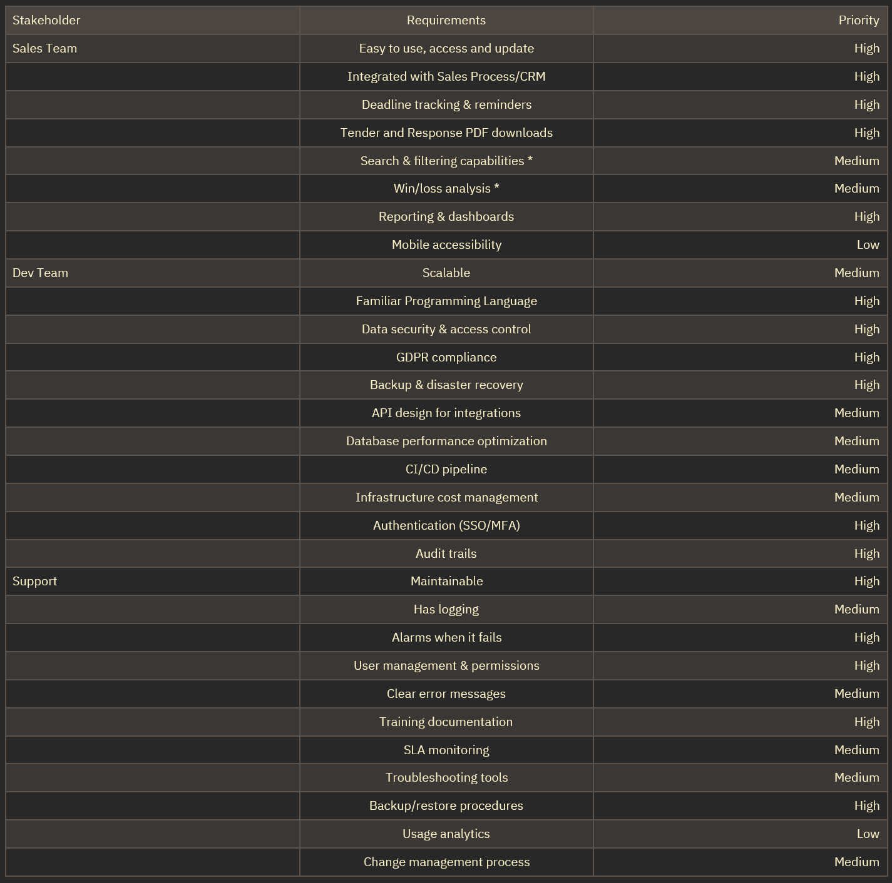
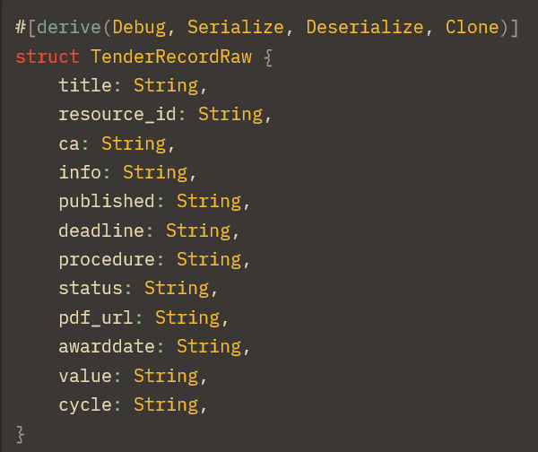
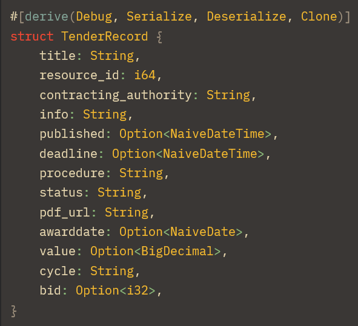
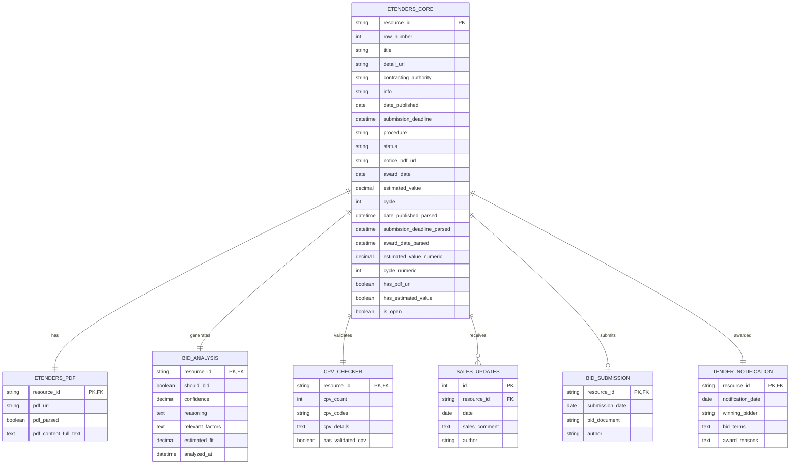
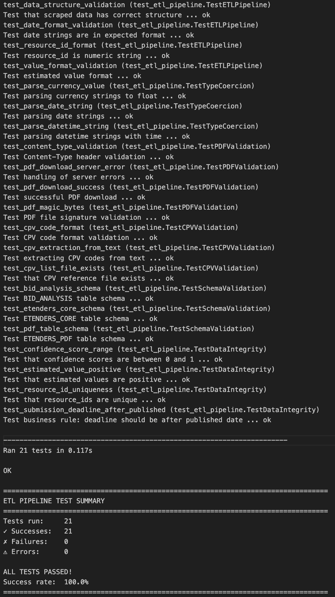
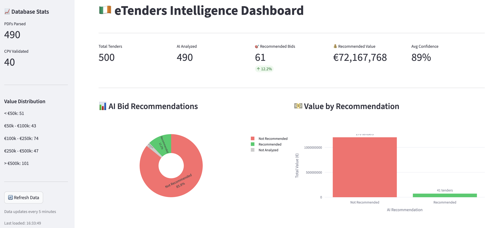
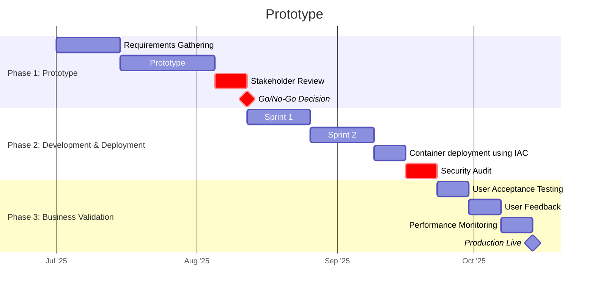

# Project 2 - Driving Business Value with Data Engineering

## Context

The eTenders application was initially designed to eliminate the time wasted reading through 50 emails per day and uses AI to discern which tenders should be responded to. The initial project scope didn't really encompass database design, integration, analysis or ongoing application support. However, from talking to stakeholders there has been some very clear feedback - the business value is actually limited and doesn't justify the application maintenance and support requirements.

This project evaluates the current state of data management for the eTenders application, identifies key stakeholder requirements, and proposes a comprehensive data engineering solution that firmly places tender requests within the whole bid response process loop. The goal is to capture tender requests, filter out irrelevant ones, and tie the success or failure of particular bids back to the original tender request - ultimately driving increased revenue through better data-driven decision making.

---

## S11: [Pass] Demonstrates the use of core technical concepts for digital and technology solutions, including: applies the principles of data analysis for digital and technology solutions

### Evidence

## Key stakeholders and requirements
<!--
Identify key stakeholders, then gather and prioritise requirements
-->
Key stakeholders are the business leaders responsible for the sales effort in Ireland, the development team who build and deploy internal applications and the support team responsible for ongoing management of their applications.

- **Sales Team**: Focus on usability, visibility, deadline management (core business needs) and winning tenders
- **Development Team**: Emphasis on security, compliance, and authentication (protecting sensitive tender data)
- **Support Team**: Priority on maintainability, alarms, user management, and documentation (keeping the system running smoothly)

<!--
| Stakeholder | Requirements                        | Priority |
|:------------|:-----------------------------------:|---------:|
| Sales Team  | Easy to use, access and update      | High     |
|             | Integrated with Sales Process/CRM   | High     |
|             | Deadline tracking & reminders       | High     |
|             | Tender and Response PDF downloads   | High     |
|             | Search & filtering capabilities *   | Medium   |
|             | Win/loss analysis *                 | Medium   |
|             | Reporting & dashboards              | High     |
|             | Mobile accessibility                | Low      |
| Dev Team    | Scalable                            | Medium   |
|             | Familiar Programming Language       | High     |
|             | Data security & access control      | High     |
|             | GDPR compliance                     | High     |
|             | Backup & disaster recovery          | High     |
|             | API design for integrations         | Medium   |
|             | Database performance optimization   | Medium   |
|             | CI/CD pipeline                      | Medium   |
|             | Infrastructure cost management      | Medium   |
|             | Authentication (SSO/MFA)            | High     |
|             | Audit trails                        | High     |
| Support     | Maintainable                        | High     |
|             | Has logging                         | Medium   |
|             | Alarms when it fails                | High     |
|             | User management & permissions       | High     |
|             | Clear error messages                | Medium   |
|             | Training documentation              | High     |
|             | SLA monitoring                      | Medium   |
|             | Troubleshooting tools               | Medium   |
|             | Backup/restore procedures           | High     |
|             | Usage analytics                     | Low      |
|             | Change management process           | Medium   |
-->


Figure 3: Business and Technical Requirements

## Research

### Database Options

By taking the characteristics of the data into account we can rule out certain database types.

It's not streaming, unstructured data so no-sql data types aren't really valuable here. While you could consider each tender record to be a "document" there really isn't the update frequency, scalability issues or fault tolerance requirements because we're dealing with less than 3000 records.

We can use a traditional SQL scheme approach because the structure of the data is well understood, it doesn't change often and we can use traditional backup methods rather than having to worry about scaling or data-replication.

- Database schema for tables is well understood
- Database schema doesn't change frequently
- Updates (writes) are infrequent
- Reads are infrequent
- Total data volume is not large (3000 - 5000 records max)  

What is possibly open for debate is how to load/update and interact with the database. Should it be in the cloud? Which one? Should it be hosted on a server or as a service? Which particular flavour of SQL should we use? Postgresql? Microsoft SQL? We can also use several Azure hosted options (Microsoft.com, 2025)

From talking to Technical & Support stakeholders we do know it needs to interact with Microsoft services (Dynamics 365, Fabric) and potentially run in Azure.

We can look at options with a weighting, including a noSQL option for comparison

| Criteria | Weight | Azure SQL | PostgreSQL | Cosmos DB |
|----------|--------|-----------|------------|-----------|\n| Sales (M365) Integration | 25% | 8/10 | 8/10 | 7/10 |
| Team Familiarity | 20% | 8/10 | 9/10 | 4/10 |
| Security & Compliance | 20% | 9/10 | 9/10 | 8/10 |
| Cost (3-5k records) | 15% | 6/10 | 9/10 | 5/10 |
| Scalability | 10% | 8/10 | 8/10 | 10/10 |
| Maintainability | 10% | 9/10 | 8/10 | 7/10 |


---

## K13: [Pass] Demonstrates the use of core technical concepts for digital and technology solutions, including: applies the principles of data analysis for digital and technology solutions

### Evidence

### Database table design

The existing application uses AWS Lamdba's written in Rust so from a basic data-gathering perspective we can make use of Rust's struct objects. Rust structs (doc.rust-lang.org, n.d.) are essentially custom objects which are the 'record' being moved and modified through the ETL pipeline.



Figure 1: Raw Tender Record

Initially everything is collected as a String type and then parsed into a more appropriate type.



Figure 2: Transformed Tender Record

This TenderRecord struct is the base object which is either passed between Lambda's or written to the database. It's not a critical consideration but Rust as a language can perform these sorts of data type changes very quickly. Rust is faster than other languages, with the possible exception of C/C+ (Vietnam Software Outsourcing - MOR Software, 2016).

#### Tender Records Table

Each record is stored in a single row, like an excel spreadsheet. There is a unique resource_id per tender so we can use this as a key for "something" but not very much consideration has been given to how to use this data beyond the Machine Learning (ML) training that was carried out initially. (robertsweetman, 2025)

In a prior ML training phase, once the eTenders table contained enough records, a percentage were manually labelled as 'tenders we should bid on' and then basic linear regression with tokenisation was run against this training data.

Being able to gain other insights from the data wasn't really considered. It's purely been used to reduce Sales admin time & to try to avoid missing any tenders which should be looked at by a human.

#### PDF Content Table

In most cases each tender has an accompanying PDF that contains more information about the bid process for that tender.

These PDF's are not always comprehensive but they do supply the AI analysis step with a lot of valuable context to help decide whether to bid on something or not.

However, from a database point of view, the entire PDF is being stored as a long text string in an accompanying pdf_content column which is linked to the main eTenders table via the resource_id key.

## DB Schema & ERD


---

## S10: [Pass] Demonstrates the use of core technical concepts for digital and technology solutions, including: initiates, designs, implements and debugs a data product for a digital and technology solution

### Evidence

## Data Pipeline & Data Sources

There are 7 data sources when it comes to updating the database, turning it into the commercial backbone of the Sales Process.

The pipeline contains the traditional Extract, Transform & Load stages BUT in fact it's more in-depth, thanks to the introduction of AI.

1. ETL
   - Scrape (extract)
   - Parse (transform)
   - Load

2. AI Enrichment
   - PDF Parsing with Ollama

3. AI Analysis
   - Bid recommendation with Ollama

4. Business Updates
   - Bid Submission
   - Sales Updates
   - Awards

Although a "load" step exists in the first "ETL" stage we're in fact writing the data to the database (or files) as each step completes.

## DB Schema & ERD



Figure 7: DB Schema and ERD

The diagram shows:

- **1:1 relationships** between `ETENDERS_CORE` and `ETENDERS_PDF`, `BID_ANALYSIS`, `CPV_CHECKER`, and `TENDER_NOTIFICATION`
- **1:Many** relationship with `SALES_UPDATES` (multiple progress updates per tender)
- **1:0 or 1** relationship with `BID_SUBMISSION` (optional, but max one per tender)

All tables use `resource_id` as the linking key, with `SALES_UPDATES` having its own auto-increment ID as the primary key.

#e1f5ff
    style F fill:#ffe1f5
    style D fill:#e1ffe1
    style G fill:#e1ffe1
    style H fill:#e1ffe1
    style I fill:#e1ffe1
    style K fill:#e1ffe1
    style M fill:#e1ffe1
    style O fill:#e1ffe1
    style J fill:#fff4e1
    style L fill:#fff4e1
    style N fill:#fff4e1
```

Figure 8: Data Pipeline Flow Diagram

The technical aspect of implementing these steps is NOT complicated and doesn't require the use of third party tools. In fact, using Python allows us to really tune the solution to our needs.

## Testing

Another advantage of writing the data pipeline ourselves is that we can create tests to comprehensively handle each step in the process.


Figure 9: Test Results

This encompasses the following: -

- Data structure checks
- Type coercion for dates & currencies
- PDF downloads & validation
- Getting the CPV codes
- Validating the DB schema
- Data integrity and business rules

Being able to check & run these tests on a consistent basis could easily be added to any deployment pipeline too.

The most important (initial) tests make sure that the eTenders data format that's being scraped hasn't been changed by the source. The Irish Govt in this case.

## Logging & Debugging

We can make sure that each step has proper logging which can be turned on as needed via the `--enable-logging` flag.

The entire data pipeline logs outputs to a file, in this case see  where we can see issues arrise and take measures to fix the pipeline directly.

Building our own data pipeline in code means we can respond flexibly and quickly to issues that arrise.

### PDF Extraction Errors

About 30% of errors (not records!) are PDF extraction errors.

```log
2025-11-28 14:39:26,109 - pdf_parser - ERROR - Error extracting text from PDF https://www.etenders.gov.ie/epps/cft/downloadNoticeForAdvSearch.do?resourceId=6965752: No /Root object! - Is this really a PDF?
Traceback (most recent call last):
  File "/Users/robert.sweetman/Documents/GitHub/module_4/python/pdf_parser.py", line 54, in extract_pdf_text
    text = extract_text(pdf_file)
  File "/Users/robert.sweetman/Documents/GitHub/module_4/python/venv/lib/python3.9/site-packages/pdfminer/high_level.py", line 177, in extract_text
    for page in PDFPage.get_pages(
  File "/Users/robert.sweetman/Documents/GitHub/module_4/python/venv/lib/python3.9/site-packages/pdfminer/pdfpage.py", line 159, in get_pages
    doc = PDFDocument(parser, password=password, caching=caching)
  File "/Users/robert.sweetman/Documents/GitHub/module_4/python/venv/lib/python3.9/site-packages/pdfminer/pdfdocument.py", line 752, in __init__
    raise PDFSyntaxError("No /Root object! - Is this really a PDF?")
pdfminer.pdfparser.PDFSyntaxError: No /Root object! - Is this really a PDF?
```

Figure 10: PDF Extraction Errors

Some URLs that are in the eTenders data are possibly HTML pages or corrupted. Now that's clear we can add defensive code fixes to the pipeline and improve the logging further.

```python
def download_and_validate_pdf(url):
    try:
        response = requests.get(url, timeout=30)
        
        # Check Content-Type header first
        content_type = response.headers.get('Content-Type', '')
        if 'application/pdf' not in content_type:
            log_error(f"Not a PDF (Content-Type: {content_type})")
            return None
            
        # Validate PDF magic bytes
        if not response.content.startswith(b'%PDF'):
            log_error(f"Invalid PDF format")
            return None
            
        return response.content
    except Exception as e:
        log_error(f"Download failed: {e}")
        return None
```

Figure 11: Python fix for PDF Extraction Errors

### Server Errors

About 35% of errors involve the server not responding to certain requests.

```log
2025-11-28 14:17:29,640 - pdf_parser - ERROR - Failed to download PDF from https://www.etenders.gov.ie/epps/cft/downloadNoticeForAdvSearch.do?resourceId=7012322: 500 Server Error: Internal Server Error for url: https://www.etenders.gov.ie/epps/cft/downloadNoticeForAdvSearch.do?resourceId=7012322
```

Figure 12: Server Errors

We can add some retry logic to the pipeline to fix this.

```python
from tenacity import retry, stop_after_attempt, wait_exponential

@retry(
    stop=stop_after_attempt(3),
    wait=wait_exponential(multiplier=1, min=4, max=60)
)
def download_with_retry(url):
    response = requests.get(url, timeout=30)
    response.raise_for_status()
    return response.content
```

Figure 13: Python Fix for Server Errors

### LLM JSON parsing errors

The LLM can produce invalid or incomplete JSON

```log
2025-11-28 14:27:26,769 - pdf_parser - ERROR - JSON Parse Error at line 1, column 202: Expecting ',' delimiter
```

Figure 14: JSON Parsing Errors

Again we can add some defensive python coding (REF: defensive coding) to address this by attempting to repair anything that contains this error

```python
def parse_with_llm_robust(text):
    prompt = """Extract structured data as valid JSON. 
    IMPORTANT: Output ONLY complete, valid JSON with all closing braces.
    
    Required fields:
    - procedure_id (string)
    - title (string)
    - buyer_name (string)
    - buyer_country (string)
    - estimated_value (number)
    
    Text to parse:
    {text}
    """
    
    try:
        response = ollama.generate(
            model='llama2',
            prompt=prompt.format(text=text[:4000]),  # Limit input
            format='json'  # Force JSON output
        )
        
        # Validate JSON before returning
        parsed = json.loads(response['response'])
        return parsed
        
    except json.JSONDecodeError as e:
        # Try to salvage partial JSON
        log_error(f"JSON parse error: {e}")
        return attempt_json_repair(response['response'])
```

Figure 15: Python fix for JSON Parsing

### Timeout Errors

We can see about 10% of errors are due to timeouts getting larger PDF's

```log
2025-11-28 14:11:49,230 - pdf_parser - ERROR - Error parsing with Ollama: HTTPConnectionPool(host='localhost', port=11434): Read timed out. (read timeout=90)
Traceback (most recent call last):
  File "/Users/robert.sweetman/Documents/GitHub/module_4/python/venv/lib/python3.9/site-packages/urllib3/connectionpool.py", line 468, in _make_request
    six.raise_from(e, None)
  File "<string>", line 3, in raise_from
  File "/Users/robert.sweetman/Documents/GitHub/module_4/python/venv/lib/python3.9/site-packages/urllib3/connectionpool.py", line 463, in _make_request
    httplib_response = conn.getresponse()
  File "/Library/Developer/CommandLineTools/Library/Frameworks/Python3.framework/Versions/3.9/lib/python3.9/http/client.py", line 1349, in getresponse
    response.begin()
  File "/Library/Developer/CommandLineTools/Library/Frameworks/Python3.framework/Versions/3.9/lib/python3.9/http/client.py", line 316, in begin
    version, status, reason = self._read_status()
  File "/Library/Developer/CommandLineTools/Library/Frameworks/Python3.framework/Versions/3.9/lib/python3.9/http/client.py", line 277, in _read_status
    line = str(self.fp.readline(_MAXLINE + 1), "iso-8859-1")
  File "/Library/Developer/CommandLineTools/Library/Frameworks/Python3.framework/Versions/3.9/lib/python3.9/socket.py", line 704, in readinto
    return self._sock.recv_into(b)
socket.timeout: timed out
```

Figure 16: Timeout Errors

So we can add a retry queue to address these problems.

```python
class ErrorHandler:
    RETRYABLE = ['500', 'timeout', 'connection']
    SKIP = ['No /Root object', 'JSON Parse Error']
    
    def handle_error(self, error, url):
        if any(e in str(error) for e in self.RETRYABLE):
            # Add to retry queue with backoff
            self.retry_queue.add(url, delay=calculate_backoff())
        else:
            # Log and skip
            self.failed_urls.add(url)
            log_to_csv(url, error, 'SKIPPED')
```

Figure 17: Python fix for Timeout Errors

<!--
Design, implement and debug a data product

RUBRIC - B

Develop a comprehensive data product meeting business requirements, with focus on scalability, performance, security and compliance. Conducts thorough testing and logging

RUBRIC - A

Develops a hightly adaptable, scalable data product exceeding current business needs. Implements a solution with optimized performance and proactive security measures. Provides actionable insights driving business value. Evaluates the use of automation and scheduling
-->


---

## K14: [Pass] Explains core technical concepts for digital and technology solutions, including: Data gathering, data management, and data analysis

### Evidence

## Data Management

<!-- The data load of eTenders is currently carried out in a pretty naive fashion. -->

The initial project scope didn't really encompass database design, integration, analysis or ongoing application support.

Storing the eTenders data as rows and then reporting against their status within the processing pipeline was the only consideration in the beginning.

There was no integration with other data sources, the Postgresql database was hosted in AWS RDS (Amazon Web Services, Inc., 2019) to be accessible from the Rust AWS Lambda code and backup provision was minimal.

However to reduce costs it is still open to the web (via username and password) since putting it behind an AWS Nat Gateway (AWS, 2020) to increase security costs an additional £30 per month.

It serves mainly as a state storage device to answer the following questions:

1. Which tenders have already been looked at
2. Where is a particular tender record in the AWS Lambda pipeline process
3. Which tenders have we suggested to the business (via email) should be looked into further

The database of tender records isn't the 'product' in this case. The 'respond to this tender' emails are currently the only product or business value resulting from all this work.

## Key Findings

From talking to stakeholders there has been some very clear feedback.

Reducing the daily tender analysis time has benefited the sales team but the strictly linear workflow (get, parse, analyse, alert) doesn't really leverage the database to deliver further business value beyond automating this one process.

The business value is actually limited and doesn't justify the application maintenance and support requirements.

This is due to technical challenges in the way this proof-of-concept (POC) has been delivered:

- Runs in AWS, not Azure
  - Version 1's infra runs in Azure so this is a general blocker to wider adoption
  - The support team are not set up to support AWS hosted apps
- Uses Rust for Lambda's
  - Developers aren't familiar with Rust and can't support it properly
- The Postgresql database is still open to the internet for technical and cost reasons
  - This is a significant security issue

The current implementation blocks further integrations with other business processes and tools, both from a commercial and technical point of view.

<!--
Highlight key findings and provide actional recommendations
-->

<!--
Evaluate the current state of data management at your organisation, including data source integration, storage, quality, compliance with GDPR/HIPAA, security, and tool effectiveness.
-->

## Needs Analysis
<!--
Detail a comprehensive needs analysis highlighting data related needs and pain points
-->
### Business Needs

The organisation needs to place the tender requests firmly within the whole bid response process loop. All the current solution does is use AI to help guard against losing the signal within the noise of up to 50 requests per day. It doesn't really add value beyond that.

How can we capture the tender requests, filter out the ones we (as an IT Solutions Consultancy) are not interested in and tie the success or failure of a particular bid back to the original tender request?

This requires a much more robust and holistic data solution which can be connected to other parts of the sales effort.

We could update the database with won and lost tenders to help avoid repeating mistakes associated with losing bids. Another example might be updating the bid database with notifications from the Irish Government about who won bids to understand more about our competitors.

If we append what we send in response to tenders that might even allow us to leverage AI to create bid response templates, improve our ML tender analysis solution with actual "won bid" data and be more confident anything our ML/AI highlights will net a positive return on the time investment to respond to a tender request.

### Technical Needs
<!-- is it POC or PoC -->
The intial POC is hard to manage because it's in both an unfamiliar language and the incorrect cloud environment for the business.

If we are going to host a more robust solution in the cloud then it at least needs to be in Microsoft's Azure.

Our database also needs to be connectable to the wider 'sales process' environment within the organisation. It's no good lobbing this into another proprietary tool that can't connect to.

<!--

Critically evaluate the design and implementation of organisational data architecture against business initiatives

RUBRIC - B

Analyses organisational data architecture, focusing on its alignment with business initiatives. Provides clear and actionable recommendations for improvement.

RUBRIC - A

Critically evaluates organisational data architecture against business initiatives. Provides a comprehensive and strategic set of recommendations for improvement, supported by clear explanations and persuasive rationale.
-->

<!--
# Milestone 1
  - Complete a detailed evaluation and restructure proposal for an existing database architecture, focusing on ACID principles and stakeholder requirements.

## Data Architecture Analysis
  - Map out the existing data sources and describe the relationships between them.
  - Evaluate the alignment of the current architecture with ACID principles, scalability, and performance.
  - Identify pain points related to the data architecture, focusing on areas affecting data quality and accessibility.
## Data Integration Challenges and Solution Proposal
  - Discuss integration challenges (data quality, compliance, security) and their impacts on business operations.
  - Develop a restructuring proposal, prioritizing stakeholder needs and outlining improvements in data flow and quality.
  - Include a brief comparison of two potential architectural solutions or tools, with a focus on security and compliance.

IMPORTANT: Create an ERD in lucidchart
-->

<!-- 
VERY IMPORTANT POINTS FROM REVIEW WITH JOE

1. Where possibe EVALUATE choices against a set of criteria
 - explain
 - analyse
 - pros/cons
 - EVALUATE

2. LO3 is a TRAP 
 - design, implement, DEBUG (examples of how to debug), automation and scheduling 

3. Look at EVERY word in the rubric and make sure it's being covered somehow.
-->

## Business Wins

In addition to the reduction in Sales admin the business can display key business intelligence information from the data.


Figure 18: eTenders Intelligence Dashboard

Shows the number of bids AI has recommended should be responded to, the total value of these bids (€72 million) while making it clear that 85% of tenders that are published aren't worth responding to!


Figure 19: eTenders Top Opportunities by Value

Shows the top opportunities by value as well as the overall distribution of AI recommended bids by value. Perhaps un-surprisingly IT consultancy related tenders tend to cluster > €500K range.

Given this visualization business stakeholders should be able to get an 'at a glance' appreciation for the value of pulling this data into a queriable database.

Having Sales Team members append update records to tenders in progress would allow them to monitor additional sales related KPI's and drive sales improvements:

- When was the last time a bid was updated?
- How often are customers contacted?
- Percentage of won/lost bids?
- How long does it take to respond to a tender?
- How many points of contact happen before a bid is won?

All of these metrics get added to the tender records as they progress to help answer the question "What does our process of winning a tender look like?"

As we see from the data, the cost of missing a bid or losing an opportunity is already very high. We can quible over implementation costs but if this effort tips the chance of winning even a portion of the €70 million then it's worth doing.

## Implementation and Rollout Plan

In order to de-risk the development and deployment of the solution we can take a phased approach

<!-- markdownlint-disable MD033 -->
<style>
  /* Default for dark themes - white text */
  .mermaid text {
    fill: white !important;
  }
  .mermaid .taskText,
  .mermaid .sectionTitle,
  .mermaid .grid text,
  .mermaid .tickText,
  .mermaid .titleText,
  .mermaid .labelText,
  .mermaid .loopText,
  .mermaid .actor text {
    fill: white !important;
  }
  
  /* Handle mdBook light and rust themes - black text */
  html.light .mermaid text,
  html.light .mermaid .taskText,
  html.light .mermaid .sectionTitle,
  html.light .mermaid .grid text,
  html.light .mermaid .tickText,
  html.light .mermaid .titleText,
  html.light .mermaid .labelText,
  html.light .mermaid .loopText,
  html.light .mermaid .actor text,
  html.rust .mermaid text,
  html.rust .mermaid .taskText,
  html.rust .mermaid .sectionTitle,
  html.rust .mermaid .grid text,
  html.rust .mermaid .tickText,
  html.rust .mermaid .titleText,
  html.rust .mermaid .labelText,
  html.rust .mermaid .loopText,
  html.rust .mermaid .actor text {
    fill: black !important;
  }
  
  /* Ensure dark themes have white text */
  html.navy .mermaid text,
  html.navy .mermaid .taskText,
  html.navy .mermaid .sectionTitle,
  html.navy .mermaid .grid text,
  html.navy .mermaid .tickText,
  html.navy .mermaid .titleText,
  html.navy .mermaid .labelText,
  html.navy .mermaid .loopText,
  html.navy .mermaid .actor text,
  html.ayu .mermaid text,
  html.ayu .mermaid .taskText,
  html.ayu .mermaid .sectionTitle,
  html.ayu .mermaid .grid text,
  html.ayu .mermaid .tickText,
  html.ayu .mermaid .titleText,
  html.ayu .mermaid .labelText,
  html.ayu .mermaid .loopText,
  html.ayu .mermaid .actor text,
  html.coal .mermaid text,
  html.coal .mermaid .taskText,
  html.coal .mermaid .sectionTitle,
  html.coal .mermaid .grid text,
  html.coal .mermaid .tickText,
  html.coal .mermaid .titleText,
  html.coal .mermaid .labelText,
  html.coal .mermaid .loopText,
  html.coal .mermaid .actor text {
    fill: white !important;
  }
  
  /* Ensure links and other specific elements have correct colors in light themes */
  html.light .mermaid .flowchart-link,
  html.rust .mermaid .flowchart-link {
    stroke: #333 !important;
  }
  
  /* Ensure links have correct colors in dark themes */
  html.navy .mermaid .flowchart-link,
  html.ayu .mermaid .flowchart-link,
  html.coal .mermaid .flowchart-link {
    stroke: #ccc !important;
  }
  
  /* Additional styles for better visibility in all themes */
  .mermaid .grid path {
    stroke-opacity: 0.5;
  .mermaid .today {
    stroke-width: 2px;
  }
</style>
<!-- markdownlint-enable MD033 -->



Figure 20: Phased Delivery Plan

### Phase 1: Prototype (6w)

The goal is to validate the technical feasibility as well as ensure all stakeholder feedback has been considered. We can use the following KPI's to ensure all the requirements have been met:

- Majority (>80%?) of stakeholders approve moving forwards
- Technically feasible in that eTenders can be obtained, stored and processed
- Prototype can be created with a set of minimum features (MVP)

#### Phase 1: Contingency

If the PoC proves challenging then pivot to using a different datasource, running everything manually for a while or deploying as something other than a container. Azure Functions might be an alternative.

### Phase 2: Development and Deployment (6w)

Phase 2 goal is to develop and deploy the solution securely in the cloud paying attention to the following measures to validate success:

- Test coverage that ensures code quality
- Successful deployment to the Azure cloud environment
- Resources deployed pass Microsoft's cloud security checks

#### Phase 2: Contingency

Deployment might be delayed to allow security issues to be patched or possibly the run-rate budget might need to increase to include higher cost protections like Nat Gateways and Azure AD for access.

### Phase 3: Business Validation (3w)

The goal here is to be able to demonstrate business value and validate user adoption in the short term. Longer term measures will only come to light after several bid cycles have been completed.

#### Short term business measures

- High (>80%) uptake of using the tool by the Sales Team
- Reduction in reported sales admin (time) by Sales Team
- User satisfaction survey reports improvement (anonymous Sales Team survey)

#### Long term business measures

- Overall increase in bids won (revenue) over a 6 - 12 month period
- Identify more opportunities to bid on
- Additional features and integrations are requested by the Sales Team as this proves the product is becoming more useful to the business overall
- Additional requests for analytics and dashboards from Sales Management which again shows interest and buy-in

#### Phase 3 Contingency

If users struggle then additional training would have to be considered and for some users to be selected to champion the use of this tool as a replacement for out-dated manual processes. As with all implementations buy in and support from Management is essential for success.

## Summary

The dashboard clearly shows the value of having a well architected data product that surfaces business value and can drive commercial success.

Taking a phased approach to delivery keeps all contributors on track and leaves scope for further improvements later.

<!--
● Set measurable goals for your data product, aiming for improvements in data processing speed, accuracy, and resource efficiency.
● Monitor improvements in processing time, data quality, resource utilisation, scalability, and error rates.
● Assess impacts on user productivity, business decision-making, cost savings, and revenue. Collect user feedback to gauge satisfaction and ease of use.
● Compile findings into a comprehensive report with visualisations for clarity.
-->

<!--

Develops a value analysis showing the potential impact of a data-driven solution and distinctly justify your approach to stakeholders (K14)

RUBRIC - B

Develops a value analysis that quantifies the potential impact of a data-driven solution across multiple business metrics. Includes thorough analysis of stakeholder needs from key departments. Provides a clear implementation plan with defined milestones.

RUBRIC - A

Develops a multi-faceted value analysis that quantifies short-term and long term impacts of a data-driven solution, including ROI projections. Incorporating analysis of stakeholder needs across all levels of the organisation. Provides a detailed implementation plan with phased rollout strategy, specific KPI's for each phase and contingency plans.

-->


