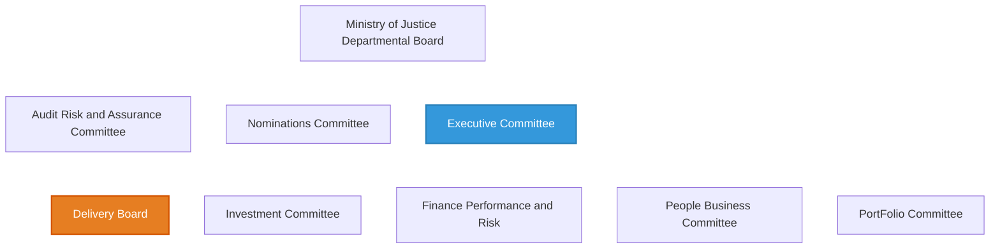
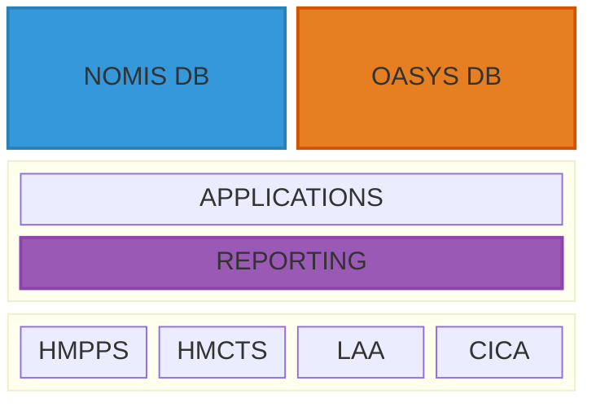
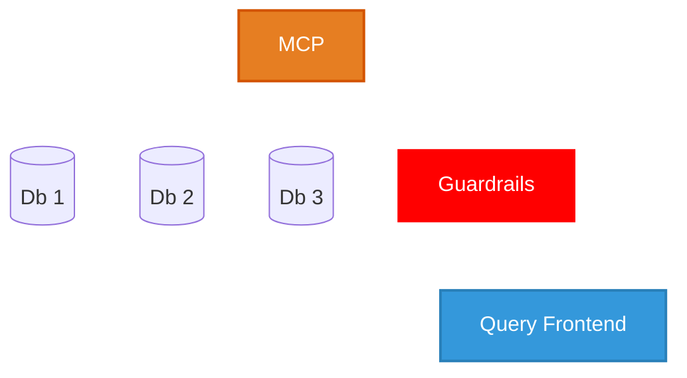

# Project 3 - Advancing your Data Strategy and Governance

## Context

This project proposes a transformative data strategy for the UK Ministry of Justice (MoJ) to address critical gaps in data transparency and ethical data management. The MoJ is responsible for Prison Facilities, Courts, Compensation, Finances and Prisoners UK-wide, operating legacy Oracle database systems (NOMIS and OASYS) that underpin all this activity.

While the MoJ recognizes the importance of its data, legacy systems remain a significant operational burden, and the Government's own State of Digital Government Review identifies that "Data is fragmented and underused" and "Critical services depend on decades-old legacy technology." More critically, the MoJ's Data Maturity Assessment scores only 2-3 out of 5 for "Managing and using data ethically" due to an overwhelming lack of transparency.

Research from the Data First Research Bulletin reveals significant ethnic inequalities in the criminal justice system - Black defendants are 41% more likely to elect Crown Court trials (leading to longer sentences), and ethnic minority defendants from Black, Mixed, Chinese, and Other White groups experience higher remand rates and custodial sentences compared to White British defendants.

The recommendation proposes using AI technology (Model Context Protocol combined with AWS Bedrock Guardrails) to democratize access to justice data while protecting PII, achieving organizational goals without requiring expensive multi-year legacy system overhauls. This approach applies Kotter's 8-step change management model, addresses cultural and security risks, and includes a phased implementation timeline spanning assessment, planning, POC, pilot, and rollout phases.

The expected impact is equitable justice outcomes through a continuous improvement cycle: Democratize Access → Increased Scrutiny → Actionable Feedback → Improve Training → Equitable Justice.

---

## K7: [Pass] Reviews the roles, functions and activities relevant to technology solutions within an organisation

### Evidence

#### Current Data Strategy and Governance



Figure 1: MoJ Governance Structure


Figure 2: MoJ Digital Strategy 2025


Figure 3: Strategic Themes


Figure 4: MoJ Focus Areas

#### Organisational Evaluation

* NOMIS - National Offender Management Information System 
    * Legacy Oracle database that has been used to manage prisoners and probationers. 
    * Original incarnation in 2004, updated in 2017.

* OASYS - Offender Assessment System
    * Legacy Oracle based system used to asses the risk of re-offending.



Figure 5: Organizational Infrastructure

* HMPPS - Her Majesty's Prison and Probation Service
* HMCTS - Her Majesty's Courts and Tribunals Service
* LAA - Legal Aid Agency
* CICA - Criminal Injuries Compensation Authority
* and more...

**There are a LOT of bodies relying on this data.**

Unlike many other UK Gov departments - the MoJ has a CTO!

#### Stakeholders and Change Process

* **Executive Board and SLT**
  * Drive change
* **Security Team**
  * Legitimacy and Confidence
* **Data and Reporting Team**
  * Evangelise Internally


---

## K9: [Pass] Describes the concepts and principles of leadership and management as they relate to their role and how they apply them

### Evidence

#### Kotter's 8 Steps for Change Management

A problem-centered model for change where Existing state != ideal state

| Step    | Details |
|---------|---------|  
| Urgency | Executive Board and SLT elect to drive changes |
| Coalition | Bring in the Security Team and Data and Reporting Team |
| Vision  | Work on the vision & strategy together |
| Communication | Communicate the vision and benefits internally |
| Empower | Uncover obstacles |
| Short-term wins | Concentrate on an internal POC |
| Consolidate | Build out the product & test internally |
| Anchor | Re-affirm the vision, strategy and outcomes before public go-live |

Figure 6: Kotter's 8-Step Change Model Applied

#### Resistance to Cultural Change 
  
* Senior management MUST buy in and communicate a clear vision
  * How improving data transparency and access will benefit all users
  * How scrutiny should not be feared, but welcomed
  * How staff will ultimately benefit on a personal level
  
* Staff who currently "own" report generation will need to adapt
  * Become stewards & facilitators, not owners
  * Appreciate a greater exposure to what users require from the data
  * Accept that insights might come from outside the org


---

## K10: [Pass] Describes the concepts and principles of leadership and management as they relate to their role and how they apply them

### Evidence

#### Risk Management and Mitigation

##### Significant push-back around security risks

* All levels of the organistion will be very concerned with the security implications
  * The technical implementation will be perceived as new and therefore untrusted
  * The idea of 'open data' is not accepted culturally
  * Possibility that the technology itself has been 'over-sold'

##### Personnel and Skills

* The MoJ, like basically every other org, has a skills gap around AI

##### Risk Matrix

|  %    | Low Impact| Medium Impact | High Impact |
|----   |-----------|---------------|-------------|
| High  |           |               |  Cultural   |
| Med   |           |  Personnel    |  Security   |
| Low   |           |               |             |

Figure 7: Risk Matrix

##### Mitigation Strategies

**Cultural**
- Senior leadership must fully embrace and evangelise the goal 
- Team leads must ALSO ensure individuals attend training
- As part of the training:
  - Show examples where open data would have led to better outcomes
  - Build a POC/demo to show staff ASAP
  - Encourage open debate as to risks/issues **once the internal pilot is live**
- Recognition this will improve outcomes for prisoners
- Convey how public perception of the MoJ will improve

**Security Risks**
- The primary goal of a POC will be to show the organisation that PII is not available
- ALL internal users will have a significant period to 'dog-food' the application before the public
- There will be a well constructed approach to security/penetration testing:
  - Trying to exfiltrate PII
  - Commission a specialist 3rd party to undertake this work
  - Have internal security staff given specialist training on how to jail-break AI tools

**Personnel**
- Encourage internal staff to expand their skills
- Resist the urge to hire external consultants
  - Create an internal team of experts whose job it is to train others and share knowledge
  - Create training centered around the goal


---

## K20: [Pass] Explains sustainable development approaches within digital technologies as they relate to their role including diversity and inclusion

[Distinction] Evaluates the impact of sustainable digital technology practices of their organisation.

### Evidence

#### UK Gov Data Maturity Assessment

UK has its OWN Data Maturity Assessment framework for Government...

##### Maturity Levels

| Score | Level | Description |
|-------|-------|-------------|
| 1 | Beginning | - Minimum legal requirements<br> - Data isn't valued<br> - No link to outcomes |
| 2 | Emerging | - Specialist access only<br> - IT responsibility only |
| 3 | Learning | - Data literacy valued in leadership roles<br> - Non-expert staff require specialist help<br> - Desire to improve<br> - Silos are being broken down |
| 4 | Developing | - Non-expert users require little specialist support<br> -Some external outreach and engagement<br> -Data seen as a priority |
| 5 | Mastering | - Org wide implementation<br> - Strong internal and external engagement<br> - Future proofing<br> - Deep capability and understanding |

Figure 11: Data Maturity Levels

##### Assessment Results

| Category | Score | Notes |
|----------|-------|-------|
| ✅ Protecting your data | 5 | Security is well established |
| ✅ Setting your data direction | 4/5 | |
| ✅ Taking responsibility for data | 4/5 | |
| Knowing the data you have | 4 | |
| Making decisions with data | 4 |  
| Engaging with others | 4 | |
| Managing your data | 4 | |
| Having the right data, skills and knowledge | 3/4 | Mainly due to lack of Senior Leadership Technical skills and internal user silos |
| Having the right systems | 3/4 | Low score due to legacy systems but there is a modernisation goal |
| ⚠️ Managing and using data ethically | 2/3 | Low score primarily due to an overwhelming lack of transparency |

Figure 12: MoJ Data Maturity Assessment

##### Summary

Legacy systems reduce data maturity, which has a knock-on effect on the ability to interrogate data or make it widely accessible.

#### Impacts of the lack of access & transparency

##### Data first research bulletin

* Based off a data-linking programe running since 2019
* Brings together 8 justice datasets 
* Only open to academics - refer to 50 page application process
* Only 40 projects completed in 5 years

##### Ethnicity and the Justice System 

_Compared to White defendants, Black defendants are significantly morelikely (41% more likely) to elect to have their case heard in the Crown Court, when controlling for age, sex, and number of previous convictions. Cases which elect to be heard in the Crown Court are more likely to result in immediate custody, and average sentence lengths are longer, also when controlling for these factors._

##### Ethnic Inequalities in the Criminal Justice System

_Ethnic minority defendants from Black, Mixed, Chinese, and Other White groups were more likely to be remanded in custody by the police than White British defendants._

_Among defendants appearing in the Crown Court who entered a plea, ethnic minority defendants had higher rates of a Non-Guilty (NG) plea than white British defendants._

_Among those convicted in the Crown Court, defendants from the Black Caribbean, Chinese and Other White group were more likely to receive a custodial sentence_

_Bangladeshi, Pakistani and Black Caribbean groups received significantly longer sentences than the White British group_

Figure 13: Ethnic Disparities in Justice Outcomes

#### Ethics, DEI and Sustainability Analysis

##### Making Data Publically accessible

* Increased scrutiny means a tendency towards justice outcomes that is more evenly applied
* Improve justice outcomes for ethnic minorities or under-represented groups
* Wider (non-academic) access leads to pressure, both internally and externally, to accept feedback and changes
* At this point we don't even know what other insights might arise 
* Cost per prison place in the UK is £46K annually
* Miscarriages of justice cost money.
  * Claims rose by 20% in 2023
  * Increase in claims by women and minorities

##### Technical implementation leapfrogs legacy issues

* Achieves an organisational and strategic goal WITHOUT a multi-year legacy overhall
  * Doesn't require the overhall of legacy systems
    * Cheaper for the tax payer
    * Renew/replace legacy apps without time pressure

##### Implementation on the EDGE of AI tech

* Given the speed of AI innovation:
  * Costs will continue to fall as the approach is implemented
* Leverage this project to attract AI talent into government
  * The 27% pension contribution for Civil Servants doesn't hurt either...

---

## S8: [Pass] Describes the concepts and principles of leadership and management as they relate to their role and how they apply them

### Evidence

#### Implementation Timeline and Phased Approach

<!-- markdownlint-disable MD033 -->
<style>
  /* Default for dark themes - white text */
  .mermaid text {
    fill: white !important;
  }
  .mermaid .taskText, 
  .mermaid .sectionTitle, 
  .mermaid .grid text, 
  .mermaid .tickText,
  .mermaid .titleText,
  .mermaid .labelText,
  .mermaid .loopText,
  .mermaid .actor text {
    fill: white !important;
  }
  
  /* Handle mdBook light and rust themes - black text */
  html.light .mermaid text,
  html.light .mermaid .taskText,
  html.light .mermaid .sectionTitle,
  html.light .mermaid .grid text,
  html.light .mermaid .tickText,
  html.light .mermaid .titleText,
  html.light .mermaid .labelText,
  html.light .mermaid .loopText,
  html.light .mermaid .actor text,
  html.rust .mermaid text,
  html.rust .mermaid .taskText,
  html.rust .mermaid .sectionTitle,
  html.rust .mermaid .grid text,
  html.rust .mermaid .tickText,
  html.rust .mermaid .titleText,
  html.rust .mermaid .labelText,
  html.rust .mermaid .loopText,
  html.rust .mermaid .actor text {
    fill: black !important;
  }
  
  /* Ensure dark themes have white text */
  html.navy .mermaid text,
  html.navy .mermaid .taskText,
  html.navy .mermaid .sectionTitle,
  html.navy .mermaid .grid text,
  html.navy .mermaid .tickText,
  html.navy .mermaid .titleText,
  html.navy .mermaid .labelText,
  html.navy .mermaid .loopText,
  html.navy .mermaid .actor text,
  html.ayu .mermaid text,
  html.ayu .mermaid .taskText,
  html.ayu .mermaid .sectionTitle,
  html.ayu .mermaid .grid text,
  html.ayu .mermaid .tickText,
  html.ayu .mermaid .titleText,
  html.ayu .mermaid .labelText,
  html.ayu .mermaid .loopText,
  html.ayu .mermaid .actor text,
  html.coal .mermaid text,
  html.coal .mermaid .taskText,
  html.coal .mermaid .sectionTitle,
  html.coal .mermaid .grid text,
  html.coal .mermaid .tickText,
  html.coal .mermaid .titleText,
  html.coal .mermaid .labelText,
  html.coal .mermaid .loopText,
  html.coal .mermaid .actor text {
    fill: white !important;
  }
  
  /* Ensure links and other specific elements have correct colors in light themes */
  html.light .mermaid .flowchart-link,
  html.rust .mermaid .flowchart-link {
    stroke: #333 !important;
  }
  
  /* Ensure links have correct colors in dark themes */
  html.navy .mermaid .flowchart-link,
  html.ayu .mermaid .flowchart-link,
  html.coal .mermaid .flowchart-link {
    stroke: #ccc !important;
  }
  
  /* Additional styles for better visibility in all themes */
  .mermaid .grid path {
    stroke-opacity: 0.5;
  }
  .mermaid .today {
    stroke-width: 2px;
  }
</style>
<!-- markdownlint-enable MD033 -->

```mermaid
gantt
    title Data Strategy Implementation
    dateFormat YYYY-MM-DD
    axisFormat %b '%y
    tickInterval 1month
    
    section Assess
    Current State   :a1, 2025-06-01, 3w
    Project Brief   :a2, after a1, 4w
    Executive Sponsorship :crit, a2a, after a1, 6w
    Stakeholder Engagement :crit, a2b, after a2, 8w
    Go/No-Go Decision :milestone, a2c, after a2b
   
    section Plan
    Technical Outline :a3, after a2b, 4w
    Ramp up Resources :a4, after a3, 2w
    
    section POC
    Investigation   :a5, after a4, 3w
    POC Development   :a6, after a4, 8w
    Internal Testing :a7, after a6, 4w
```

Figure 8: Data Strategy Implementation - Phase 1

```mermaid
gantt
    title Data Strategy Implementation - Deployment
    dateFormat YYYY-MM-DD
    axisFormat %b '%y
    tickInterval 1month
    
    section Pilot
    Staff Training   :a1, 2026-02-01, 6w
    Internal Pilot   :a2, after a1, 12w
    Security Testing :crit, a3, after a1, 12w
    Pilot Assesment Period :a4, after a3, 12w
    Pilot Review     :milestone, a5, after a4
    
    section Rollout
    Rollout Go/No-Go Decision :milestone, a6, after a4
    Rollout      :a7, after a6, 24w
    Assessment   :milestone, a8, after a7
```

Figure 9: Data Strategy Implementation - Phase 2

Assessments will be ongoing to course correct to meet the goals over the long term.

#### Technical Implementation Architecture



Figure 10: Technical Architecture

* MCP - model context protocol
* Guardrails - PII blocking
* Query Frontend - democratized access to data


---

## B8: [Pass] Explains sustainable development approaches within digital technologies as they relate to their role including diversity and inclusion

### Evidence

#### Gap Analysis

##### Wins

* Databases are on the cloud
* Migration from Azure -> AWS has delivered an Infrastructure as code (IaC) solution
  * More robust disaster recovery
  * Better security posture
  * Increased reliability
  * Better monitoring
  * Promised lower costs following migration
    * An opportunity to turn things off  

##### Fails

* Databases are still hosted on expensive VMs, not run as a managed service
* Database licensing costs are still high (Oracle)
* A lot of legacy apps had to move under un-supported OS and application version...
* Reporting using the legacy systems use SAP Business Objects, only recently upgraded

##### Data Challenges

* Production data access requires security clearance
* Data analysis requires specialist knowledge, tools and training
* Data is not anonymised so cannot be made available to the public generally
  * You _can_ fill in a 50 page form to apply for access with no guarantee of success
  * Little outside scrutiny means that outcomes based on data are potentially unreliable

##### Government's own State of Digital Government Review

**Data is fragmented and underused.**

_This holds back AI, machine learning, and advanced analytics. Only 27% of survey respondents believe their current data infrastructure enables a comprehensive view of operations or transactions. 70% say their data landscape is not well co-ordinated, interoperable, and does not provide a unified source of truth._

**Critical services depend on decades-old legacy technology.**

_The scale of legacy varies by organisation and is not consistently measured, but it is estimated to comprise 28% of systems in central government departments in 2024, an increase from 26% in 2023._

#### Recommendation for Change

##### Increase Public Access

* From the Government's own Data Maturity Model there is a lack of transparency. 

* Ethical/discrimination issues go un-addressed.
  * There's a difference between a suspicion of discrimination vs. data-backed evidence

* The data is only available for accedemic scrutiny under strict supervision. 
  * This effectively limits it's value to the organisation and the public since insights may only appear slowly and on an ad-hoc basis, if at all.

_It's hard to claim that the MoJ is a Data Driven organisation when the data is not available to wider scrutiny._

##### The pre-AI solution

Initiate a multi-year project to anonymise the data, eventually making it publicly available.

This would require significant technical changes:
- Modernisation and standardisation of the databases, schemas and various tables inside them.
- Likely re-write of key legacy applications
- Large scale anonymisation effort on an ongoing basis
- Significant security improvements to allow for public access
- Increased cost, unless the data is made available in a more cost effective way

Even with this type of re-write/re-architecture it would likely remain the case that only specialist data scientist would be able to gain insight from it.

##### The post-AI solution

AI agents that leverage the Model Context Protocol
* Connect to data in any form 
* Ask questions using natural language rather than a query language
* Return anonymized results

At a high level combining the MCP with (for example) AWS Bedrock Guardrails would allow for a secure, anonymised and queryable data set to be made available to the public.

This would also allow the data to be queried in a natural language format, a key to opening up engagement to non-academic users.

#### Impact Analysis


Figure 14: Continuous Improvement Cycle

* Democratize Access  - AI, MCP and PII blocking allows wider access to data
* Increased Scrutiny  - Leads to more transparency, wider range of insights
* Actionable Feedback - Insights are surfaced to improve justice outcomes
* Improve Training    - Training is likely needed to effect real change
* Equitable Justice   - Fair application of justice/law interpretations

##### Justice will bend towards being applied fairly across race/cultures and other dimensions

* The gap in outcomes between white vs. ethnic minority offenders should tend towards zero
  * Achievable by increasing training around fairness and bias in sentencing
  * Driven by transparency in data reporting this is a realistic and desirable goal
  * **Measure dimensions across sentencing, re-offending and conviction rates**

* Where this _doesn't_ start lining up there is obviously also something else at play
  * Inconsistencies can be properly investigated 
  * Ordinarily, anomalies wouldn't surface from data that can't be transparently scrutinized
  * **Create Policies to address these particular outliers**

* Allows commentators, as well as the MoJ itself, to rely on a publically available data-set
  * Reduces perception of bias as well as media or political exploitation of a lack of transparency
  * Drives improved perception of the MoJ from the outside, as well as internally
  * **Measure whether cultural perception of the overall UK Justice system goes up**

**Caveat: These goals might take a number of years to manifest**
