# Project 4 - Integrating Machine Learning and AI to Drive Business Value

## Context

This project develops a machine learning solution to filter Irish government tender opportunities for an IT consultancy. The Irish Government releases a huge range of tenders daily via email - from bin collection and recruitment services to IT consulting contracts. Wading through this firehose of 50+ tenders per day manually is time-consuming, inefficient and leads to missed multi-million euro opportunities.

The solution uses supervised machine learning to answer "Which tenders should we actually bid on?" by training a model on 2000+ manually labeled tender records. After investigating Decision Trees (which over-fitted badly with 41% precision and missed two-thirds of real bids), the project settled on **TF-IDF vectorization with Linear SVM classification**, achieving significant improvements by incorporating PDF content analysis.

The final model reduces manual review workload by 50% while cutting missed opportunities by nearly a third. The technical stack includes:
- **Data Pipeline**: Rust-based AWS Lambda functions + Terraform IaC for cloud deployment
- **ML Training**: Python with scikit-learn, Jupyter notebooks for iterative development
- **Data Storage**: AWS RDS PostgreSQL database
- **Version Control & CI/CD**: GitHub Actions for automated deployment

The project demonstrates ethical AI governance (Version 1's AI framework), regulatory compliance (GDPR, OGP permissions), and addresses trust issues around "black box" AI systems by ensuring transparency through documented Jupyter notebooks and appointing specific AI/ML ownership.

Key achievements: False negative reduction from 13 to manageable levels, enhanced model performance using tender codes extracted from PDFs via One-Hot Encoding, and a phased deployment approach with stage gates following prototype and smoke test phases.

---

## K6: [Pass] Explains core technical concepts for digital and technology solutions, including: The approaches and techniques used throughout the digital and technology solution lifecycle and their applicability to an organisation's standards and pre-existing tools

### Evidence

## Application Development Lifecycle

We're going through app development stages which map onto the Project Gantt chart in Team Collaboration section.

### Requirements Gathering

Stakeholders, in this case Version 1's Sales Team for Ireland, would clearly love to avoid trawling through un-related tenders of no interest to an IT consultancy. However, there is a significant opportunity cost to missing relevant tenders. This translates into a solid requirement where we're trying to reduce workload BUT not at the expense of a huge false negative rate where the model elects to mark a tender as 'no-bid' when it might be hugely valuable.

### Prototype

#### Data Gathering

We can automate data gathering, manipulation and storage by leveraging infrastructure as code (IaC) tools like Terraform. This brings up an AWS RDS PostgreSQL database in the cloud, uses AWS Lambdas (written in Rust for speed and cheapness) to get the data and pipe the data into the database.

To avoid the "it works on my machine" problem we should use GitHub Actions to drive cloud deployment, Lambda updates and ultimately ML execution/testing/training. Using action runners means anyone in the team can update the application, following appropriate review of course.

#### Model Selection

Python's wide range of ML libraries, and Jupyter notebooks allow us to quickly iterate on a data-frame and most importantly validate what the model might be doing or missing.

It's not simply a case of throwing some data at a model, getting a nice looking F1 score (or something else) and deploying it. We absolutely have to take into account the business requirements.

Here's where the key testing and investigation work around ML happens.

### Development

Following architectural design and planning this phase runs in 2 week sprints to fulfill user stories that deliver incremental value. This ensures that if any blockers do arise they're identified early and don't derail the entire project in the last weeks.

A key section in here is testing that 'all' tender records can be ingested, and making sure there are schema checks around data ingestion. As we're using Rust for a lot of the data pipeline it's type and compiler checking add a lot of value here.

### Deployment

Before official 'go-live' everything runs in the cloud environment as a 'smoke test' but the results are private and highly scrutinised by the development team. Once they're happy a go/no-go decision can be made in consultation with the stakeholders, based on the results from running the ML model and reviewing the tenders it's suggesting, as well as those it's rejected.

We can extend the automation already used in the prototyping phase to actually deploy the production components, update the ML model, update various Lambda functions and add functionality like informing the sales team that a bid should be looked at.

After the deployment is live we might find users have feedback or there might be updates needed to deal with unforseen issues. Since the deployment pipeline is now automated this shouldn't prove too challenging.

## Integration into existing digital solution lifecycle

One of the key aspects of software development that especially applies to ML is quick iterations to see what may give a useful result.

We can use jupyter notebooks and Python's ML libraries for this 'prototyping and analysis' phase. This can sit very easily within the larger project and quickly drive the 'ML' part of the solution.

Breaking the delivery down into two week sprints, setting stage goals, reviewing the work on a regular basis with the stakeholders are all part of modern software delivery. An agile approach allows developers to change direction when faced with new information or requirements.

Developers can independently work on the ML part without relying on or becoming a bottleneck for other components like hosting, access, deployment etc.


---

## K7: [Pass] Reviews the roles, functions and activities relevant to technology solutions within an organisation

### Evidence

## Team Roles and Responsibilities

Modern software development now sits on top of a whole tool chain to surface work, encourage transparency and foster communication. In this type of project we'd keep all the code in source control (Git), all the tasks in Jira and run a daily agile-type stand-up to share progress or air any blockers.

There's usually a chat app like Slack or Teams for quick threads to tackle particular issues or problems.

Outside the feature development being carried out by developers there would be a **Team Lead**, nominally set with tasking individuals with work as well as acting as an arbiter on technical direction. Possibly there would be a Software Architect fulfilling this role but if it's a smaller project this might be unnecessary.

The Team Lead would also likely interface to the **Project Manager** who would have overall responsibility for reporting outwards as to the state of the development, especially in relation to time to completion. Their role involves understanding the true state of the project and communicating this to stake-holders. Expectation management is key here, especially if something un-expected comes up and there _might_ be a possible delay.

You could easily use dashboards to broadcast the current project state, identify key milestones and plot progress along a gantt chart (see S7 section below).

## Appointing AI/ML Ownership

As with any new technology a huge factor associated with it's introduction is trust.

Primarily, can users rely on what they're being told? Can we assemble a body of evidence in the training of tools like this to prove it will work as intended, save on 'drudge' filtering work and not negatively impact the business?

There are many instances where software has been used as a smokescreen for dodging accountability, the Post Office scandal being the most egregious recent example.

Adding AI increases the temptation to simply offload governance entirely to a "black box". Consumers are already abdicating responsibility for major life decisions to AI sometimes very much to their own detriment. Businesses may end up being no different if ethics aren't adhered to.

To address these issues we can take some concrete steps:

* Making sure that the ML model's workings are explained simply (see Appendix for links to Jupyter Notebooks).
* **Appointing an Owner specifically responsible for the behaviour of the AI/ML aspect of the solution.**
* Adding feedback loops and an update schedule so that, even after it's deployed, it can be re-trained and upgraded.


---

## K13: [Pass] Demonstrates the use of core technical concepts for digital and technology solutions, including: applies the principles of data analysis for digital and technology solutions

### Evidence

## Data Ingestion, Investigation and Prep

Each record consists of the following:

**tender records** table

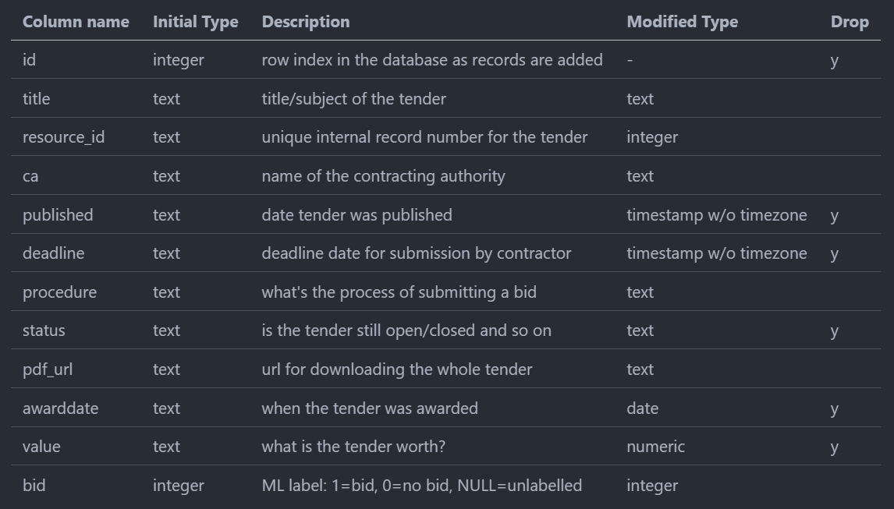

Figure 1: Tender Records Database Schema

All this has been pulled into PostgreSQL database for easy manipulation. We'll 'drop' all the date columns as they're irrelevant to our question.

Then we can go through each column and decide whether it needs further attention.

### Labelling the 'bid' column for Supervised learning

To train a supervised learning model on this data we've had to manually label 2000+ records with bid (1) or no bid (0), which took around 2 hours.

### Data Manipulation/Cleanup

#### id
This can be removed since `resource_id` is unique, we don't need another id.

#### title
This is the key field we're looking at training the model on to predict whether we should bid (1) or not (0). Happily EVERY record has a title field so we don't have to deal with null data in this case.

#### contracting authority (ca)
CA has a finite number of possibilities so we're going to one-hot encode this.

#### procedure
Procedure has a finite number of possibilities so we're going to one-hot encode this.

#### pdf_url
Not relevant so can be removed from the training data. We could _maybe_ turn this into a data point but this is problematic as 25% of tenders don't have a PDF attached to them.

#### value
Again nearly 50% of records don't have a value and making any assumptions about these (filling in values, adding a mean) would likely only introduce innacuracies. Conversely there might be multi-million pound values hidded in the PDF content. So with this in mind we can't rely on value as a feature of the tender data for ML training.

## ML and AI in this use-case

Let's clarify the difference between Machine Learning (ML) and AI since ML has been very much been run over by AI hype.

AI as offered by ChatGPT, Anthropic Claude etc. relies on exposure to huge amounts of data with the goal of developing a more general response to a much wider range of questions across different subjects.

Machine learning uses past data, algorithms and pattern identification to predict some sort of future state given data that hadn't been seen before. This is usually within a specific realm or narrow topic and takes one of three general approaches - supervised, un-supervised and semi-supervised.

**Supervised learning** seems most appropriate because by labelling the data we can teach the model what is important so that it can recognise the difference between tenders to bid on and not to bid on.

Since we're asking a simple question ("Is this tender suitable to make a bid on or not?") that isn't something we can assume will work with un-supervised learning because there's no inherent pattern to learn/discover. We're primarily going to rely on one feature (title in tender_records) which isn't sufficient for an un-supervised approach to work.

Similarly, semi-supervised learning isn't appropriate yet because we only have labelled records. In six, twelve or twenty-four months it might be well worth taking the baseline supervised model and re-running the training.


---

## K19: [Pass] Applies relevant legal, ethical, social and professional standards to digital and technology solutions considering both technical and non-technical audiences and in line with organisational guidelines

[Distinction] Justifies the application of relevant legal, ethical, social and professional standards to digital and technology solutions.

### Evidence

## Ethical Considerations

Training ML models should pay attention to local laws & statutes (i.e. GDPR), ensure the data is used in an ethical way and aim for transparency when it comes to any decisions that are underpinned by any sort of AI or ML training process.

Version 1 also has a AI Governance framework that goes through a number of discovery steps to ensure directives around AI are adhered to, maintain compliance and ensure any ethical and social implications are made clear to all parties involved.

### Trust and Accountability

As with any new technology a huge factor associated with its introduction is trust. Primarily, can users rely on what they're being told? Can we assemble a body of evidence in the training of tools like this to prove it will work as intended, save on 'drudge' filtering work and not negatively impact the business?

There are many instances where software has been used as a smokescreen for dodging accountability, the Post Office scandal being the most egregious recent example.

Adding AI increases the temptation to simply offload governance entirely to a "black box". Consumers are already abdicating responsibility for major life decisions to AI sometimes very much to their own detriment. Businesses may end up being no different if ethics aren't adhered to.

### Transparency Measures

To address these issues we take concrete steps:

* **Making sure that the ML model's workings are explained simply** - All Jupyter notebooks are documented and available in the GitHub repository
* **Appointing an Owner specifically responsible for the behaviour of the AI/ML aspect** - Clear accountability chain
* **Adding feedback loops and an update schedule** - Monthly retraining recommended to update the model as new tenders are published

## Regulatory Compliance

Version 1 (V1) is already signed up to access the eTenders data and respond so there is no part of the proposed usage that prohibits it's use, other than onward transmission to third parties.

That said, for this to be more than a proof of concept/demo it would be appropriate to obtain permission from the Office of Government Procurement (OGP) to do anything further. At this stage everything is being used for learning and study, not commercial application.

However, with this in mind, it's already been proposed internally within V1 to respond to the OGP's question about how AI/ML might help them manage the tender process, increase transparency and modernise how they publish tenders by sharing this project/proof of concept with them.

### GDPR and Data Protection

All tender data is publicly available government procurement information. No personal data is processed. The PostgreSQL database is secured within AWS RDS with appropriate access controls.


---

## K24: [Pass] Describes how to interpret and implement a design, compliant with functional, non-functional and security requirements

### Evidence

## Functional Requirements

### Primary Requirement: Reduce False Negatives

Stakeholders, in this case Version 1's Sales Team for Ireland, would clearly love to avoid trawling through un-related tenders of no interest to an IT consultancy. However, there is a **significant opportunity cost to missing relevant tenders**.

This translates into a solid requirement where we're trying to reduce workload BUT not at the expense of a huge false negative rate where the model elects to mark a tender as 'no-bid' when it might be hugely valuable.

### Acceptance Criteria

* **Reduce manual review workload** - Target 50% reduction achieved
* **Minimize false negatives** - Missing a multi-million euro opportunity is unacceptable
* **Maintain recall** - Must catch all potentially valuable tenders
* **Allow threshold adjustment** - Business can tune false positive vs false negative trade-off

## Non-Functional Requirements

### Performance

* Process daily batch of 50+ tenders within acceptable timeframe
* Model inference time must not delay notification to sales team

### Scalability

* AWS Lambda functions scale automatically
* PostgreSQL database sized appropriately for tender volume
* Terraform IaC allows infrastructure scaling

### Maintainability

* Jupyter notebooks document all model decisions
* GitHub repository contains complete codebase
* CI/CD pipeline enables easy updates
* Monthly retraining schedule for model updates

### Reliability

* Infrastructure as Code ensures reproducible deployments
* Rust's type system and compiler checking reduce runtime errors
* Smoke test phase validates production readiness

## Security Requirements

### Data Access

* AWS RDS PostgreSQL database with access controls
* No personal data processed (public government tenders only)
* Credentials managed securely via AWS Secrets Manager

### Code Security

* GitHub Actions for automated deployment (no manual credential exposure)
* Rust memory safety prevents buffer overflows and memory leaks
* Infrastructure isolated within AWS VPC

### Compliance

* GDPR compliance through public data usage only
* OGP permission obtained for production use
* Version 1 AI Governance framework adherence


---

## S4: [Pass] Demonstrates the use of core technical concepts for digital and technology solutions, including: initiate, design, code, test and debug a software component for a digital and technology solution

### Evidence

## Software Component Development

### Data Pipeline Architecture

The complete data pipeline consists of:

1. **AWS Lambda Functions (Rust)** - Fast, cheap, type-safe data processing
   - `get_data` - Scrape eTenders, format with correct types, store in PostgreSQL
   - PDF processing - Extract tender codes and text from PDFs
   - Database operations - Managed PostgreSQL interactions

2. **Infrastructure as Code (Terraform)** - Reproducible cloud deployments
   - AWS RDS PostgreSQL database provisioning
   - Lambda function deployments
   - S3 buckets for ML model artifacts
   - VPC and security group configuration

3. **ML Training Pipeline (Python)** - scikit-learn model development
   - TF-IDF vectorization
   - Linear SVM classification
   - Model persistence to S3
   - Inference Lambda integration

### Code Quality and Testing

**Rust Benefits:**
* Type system catches errors at compile time
* Memory safety without garbage collection
* Fast execution for Lambda cold starts
* Compiler checking adds significant value

**Schema Validation:**
* Testing that 'all' tender records can be ingested
* Schema checks around data ingestion
* Database constraints enforce data integrity

### Debugging and Iteration

**Jupyter Notebooks for Exploration:**
* `etenders.ipynb` - Initial investigative model workbook
* `decision_tree_model.ipynb` - Proving why decision trees fail
* `baseline_text_models.ipynb` - Comparing tokenization methods
* `tfidf_linearSVM.ipynb` - Final model selection and validation
* `comparison.ipynb` - PDF content enhancement analysis

**GitHub Actions CI/CD:**
* Automated deployment on code changes
* Lambda updates without manual intervention
* Avoids "it works on my machine" problems


---

## S7: [Pass] Explains how teams work effectively to produce a digital and technology solution applying relevant organisational theories using up to date awareness of trends and innovations

### Evidence

## Team Collaboration and Communication

Modern software development now sits on top of a whole tool chain to surface work, encourage transparency and foster communication. In this type of project we'd keep all the code in source control (Git), all the tasks in Jira and run a daily agile-type stand-up to share progress or air any blockers.

There's usually a chat app like Slack or Teams for quick threads to tackle particular issues or problems.

You could easily use dashboards to broadcast the current project state, identify key milestones and plot progress along a gantt chart.

## Project Timeline and Stage Gates

<!-- markdownlint-disable MD033 -->
<style>
  /* Default for dark themes - white text */
  .mermaid text {
    fill: white !important;
  }
  .mermaid .taskText, 
  .mermaid .sectionTitle, 
  .mermaid .grid text, 
  .mermaid .tickText,
  .mermaid .titleText,
  .mermaid .labelText,
  .mermaid .loopText,
  .mermaid .actor text {
    fill: white !important;
  }
  
  /* Handle mdBook light and rust themes - black text */
  html.light .mermaid text,
  html.light .mermaid .taskText,
  html.light .mermaid .sectionTitle,
  html.light .mermaid .grid text,
  html.light .mermaid .tickText,
  html.light .mermaid .titleText,
  html.light .mermaid .labelText,
  html.light .mermaid .loopText,
  html.light .mermaid .actor text,
  html.rust .mermaid text,
  html.rust .mermaid .taskText,
  html.rust .mermaid .sectionTitle,
  html.rust .mermaid .grid text,
  html.rust .mermaid .tickText,
  html.rust .mermaid .titleText,
  html.rust .mermaid .labelText,
  html.rust .mermaid .loopText,
  html.rust .mermaid .actor text {
    fill: black !important;
  }
  
  /* Ensure dark themes have white text */
  html.navy .mermaid text,
  html.navy .mermaid .taskText,
  html.navy .mermaid .sectionTitle,
  html.navy .mermaid .grid text,
  html.navy .mermaid .tickText,
  html.navy .mermaid .titleText,
  html.navy .mermaid .labelText,
  html.navy .mermaid .loopText,
  html.navy .mermaid .actor text,
  html.ayu .mermaid text,
  html.ayu .mermaid .taskText,
  html.ayu .mermaid .sectionTitle,
  html.ayu .mermaid .grid text,
  html.ayu .mermaid .tickText,
  html.ayu .mermaid .titleText,
  html.ayu .mermaid .labelText,
  html.ayu .mermaid .loopText,
  html.ayu .mermaid .actor text,
  html.coal .mermaid text,
  html.coal .mermaid .taskText,
  html.coal .mermaid .sectionTitle,
  html.coal .mermaid .grid text,
  html.coal .mermaid .tickText,
  html.coal .mermaid .titleText,
  html.coal .mermaid .labelText,
  html.coal .mermaid .loopText,
  html.coal .mermaid .actor text {
    fill: white !important;
  }
  
  /* Ensure links and other specific elements have correct colors in light themes */
  html.light .mermaid .flowchart-link,
  html.rust .mermaid .flowchart-link {
    stroke: #333 !important;
  }
  
  /* Ensure links have correct colors in dark themes */
  html.navy .mermaid .flowchart-link,
  html.ayu .mermaid .flowchart-link,
  html.coal .mermaid .flowchart-link {
    stroke: #ccc !important;
  }
  
  /* Additional styles for better visibility in all themes */
  .mermaid .grid path {
    stroke-opacity: 0.5;
  }
  .mermaid .today {
    stroke-width: 2px;
  }
</style>
<!-- markdownlint-enable MD033 -->

### Phase 1: Prototype

```mermaid
gantt
    title Prototype
    dateFormat YYYY-MM-DD
    axisFormat %b '%y
    tickInterval 1month

    section Prototype
    Stakeholders Discussion :a1, 2025-07-01, 2w
    Data Gathering :a2, after a1, 3w
    Prototype :a3, after a2, 8w
    Review :crit, a4, after a3, 1w
    Go/No-Go Decision :milestone, a5, after a4
```

Figure 16: Prototype Phase Timeline

### Phase 2: Development

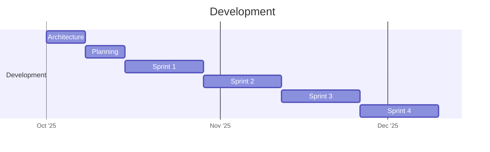

Figure 17: Development Phase Timeline

### Phase 3: Deployment

```mermaid
gantt
    title Deployment
    dateFormat YYYY-MM-DD
    axisFormat %b '%y
    tickInterval 1month

    section Deployment
    IaC deployment :a1, 2026-01-01, 2w
    Smoke Test :crit, a2, after a1, 4w
    Go/No-Go Live :milestone, a3, after a2
    Live Trial :a4, after a3, 4w
    User Feedback :a5, after a4, 2w
    Model Update :a6, after a5, 1w
```

Figure 18: Deployment Phase Timeline

There are **stage gates** following prototype delivery and after the model has been deployed (smoke test) for a number of weeks. This first gate gives stakeholders the opportunity to see how the application would work in theory. The second gate is for developers to check that the solution actually works in practice before 'go-live'.

Then, once it's been running for two to four weeks updates can be made based on live data and user feedback. Maybe there's some part of the performance that needs tweaking?

## Sharing Best Practices

From my experience within Version 1 the primary way that best practices are shared is via **'lunch and learn' sessions**. It's always challenging to pull people's attention from client work so recorded sessions make the information more accessible.

Keeping these up-to-date might mean creating your own internal news letter, blog or wiki that updates the same topic when new or better ways of doing things come to light. Making this content public also massively boosts the organisations visibility and credibility in the wider world.

## Agile Methodology Benefits

* **2-week sprints** - Deliver incremental value, identify blockers early
* **Daily stand-ups** - Surface progress and blockers quickly
* **Flexibility** - Change direction based on new information or requirements
* **Independent work streams** - ML development doesn't block infrastructure work


---

## S10: [Pass] Demonstrates the use of core technical concepts for digital and technology solutions, including: initiates, designs, implements and debugs a data product for a digital and technology solution

### Evidence

## Model Selection and Debugging

We're looking to make a decision ("bid on this or not?") so it seemed immediately obvious to start our investigation using a decision tree. However, there's a fundamental issue with that assumption because our main piece of data on which to answer this bid/no-bid question is the tender title, which is all text. Additionally our data is highly weighted towards 'no-bid' as an outcome which makes using decision trees problematic.

Think of it this way, the text field is going to be turned into a large list of numbers with one dimension per possible word, most of which aren't useful so end up being zero.

In a decision tree every split asks about the value of a word but we're doing this on very sparse data where there's far more "mostly zero" features that don't impact on whether a tender should be considered a bid opportunity. This means that if a word appears only once it easily lets the tree recognise a single record. Additionally it will perform very well on data it's already seen but badly on new records and it won't know what to do with tender titles that contain words it hasn't seen before.

### Decision Tree Results

Refer to `decision_tree_model.ipynb` for the code.

Here's what we get initially:


Figure 2: Decision Tree Performance Metrics

This approach really falls down when looking for bids. We're only hitting 41% of real bids (precision) and recall is also really low. So we can say the model is excellent at recognising 'no-bids' but it's **missing two-thirds of real bids** and miss-labelling many non-bids as bids (low f1-score).

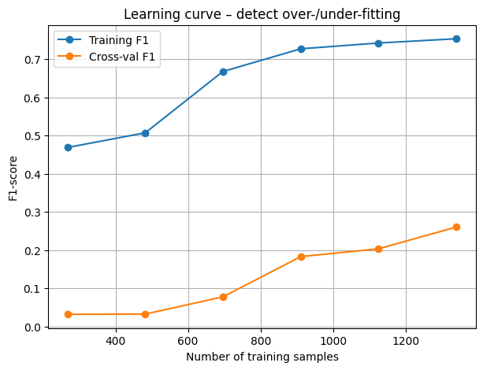

Figure 3: Decision Tree Learning Curve - Over-fitting

We can also show visually how this type of approach over-fits quite badly by plotting the learning curve. The model performs much better on data it's seen before (blue) than new data (orange). The curves don't converge and they should if the fit was good.

Most importantly, even when you add more training data the gap doesn't close which indicates the model has learnt patterns based on that only, rather than a general pattern.

### Linear Regression Investigation

With this in mind we need to look at what's better at least for this type of data. We still have only two possible outcomes and linear regression can also cope with this as well as being better dealing with the short text strings we have in our 'tender title' field.

If we use a **Logistic (linear) Regression instead**, every text feature is treated independently and there's no branching that the model might memorise. Also, having a lot of 'non-interesting' words doesn't have a massive impact as well as being better able to handle words it's not seen before. You get enough of a signal from words it does know about as opposed to a decision tree where if something doesn't appear in a tree 'branch' it fails to generate a score at all. This approach copes a lot better with previously unseen titles.

Refer to `etenders.ipynb` for the code.

After we've pulled in the data to create a dataframe using a helper script it's worth taking some time to look at the data including words that push the model to 'bid' or 'no-bid':

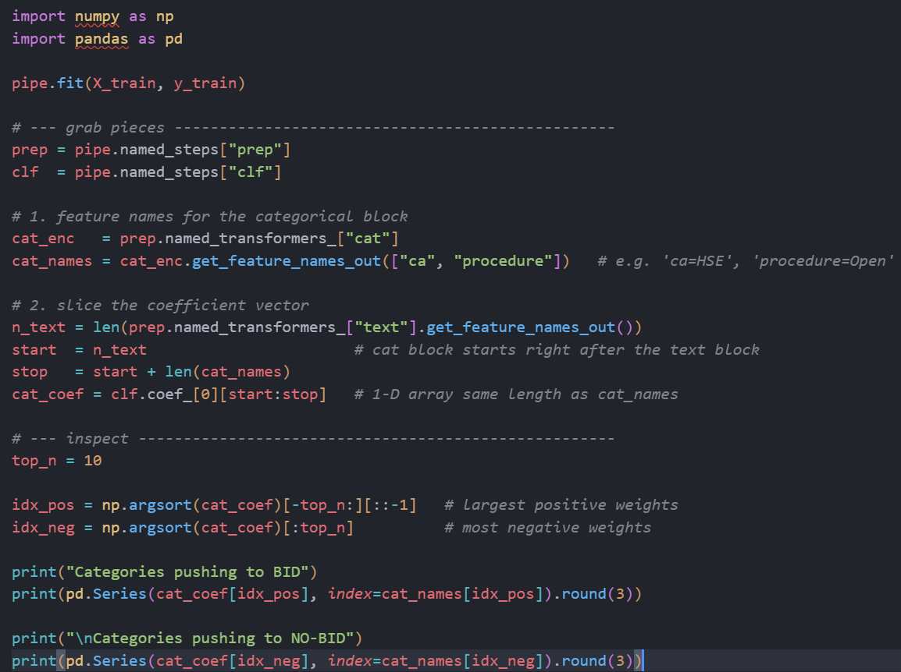

Figure 4: Code to Identify Influential Words

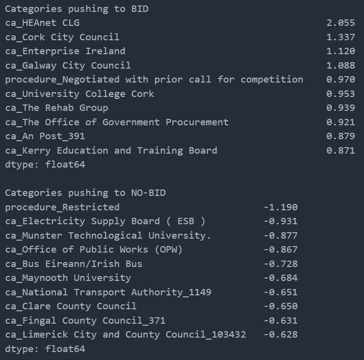

Figure 5: Words That Influence Bid/No-Bid Decision

We're looking at text, categorical values and numeric fields. It might also be interesting to see if the numeric field ('has-pdf') is adding any value here at all.

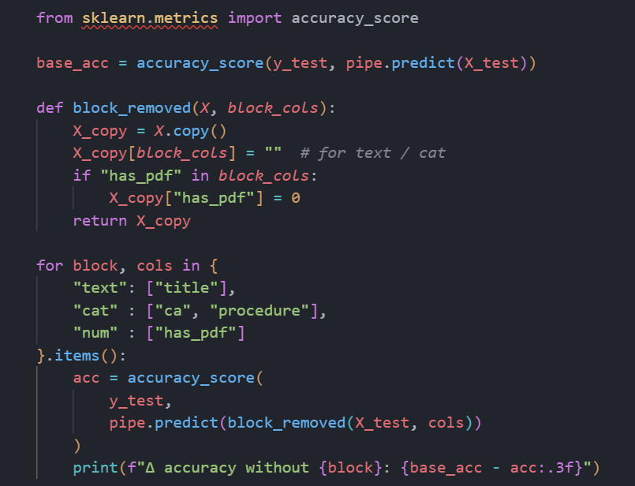

Figure 6: Testing Numeric Field Influence

* accuracy without text: -0.017
* accuracy without cat: -0.031
* accuracy without num: -0.007

Looks like we can basically remove the 'has_pdf' column from the data.

We can also look at what individual categories most impact or detract from a tender being market as a bid.

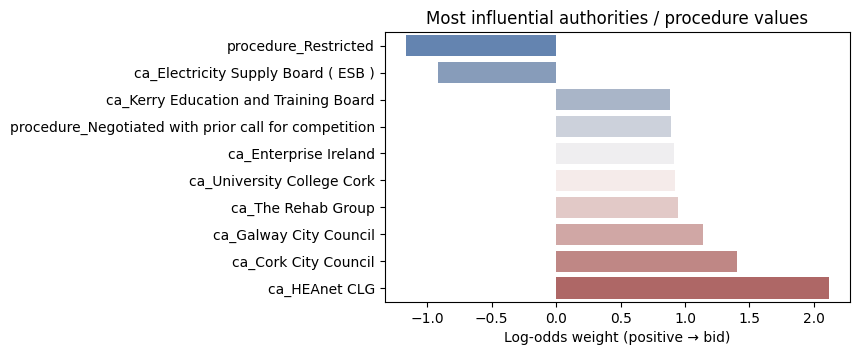

Figure 7: Most Influential Categories and Procedures

However, once we start looking at the outcomes (via a confusion matrix) we begin running into the issue with the title data as the starting point and our goal of reducing false positives and the overall 'filtering' workload.

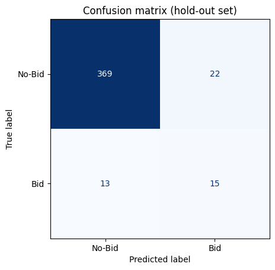

Figure 8: Initial Confusion Matrix

With a default threshold of 50% we're getting 13 Bids labelled as No-Bid i.e. a pretty high false-negative rate. Since a false negative might be worth a few million Euros this doesn't justify saving someone time doing the filtering because at this point that saving doesn't equate to the missed opportunities value...

### Tokenizer Comparison

As an exercise I decided to look at whether tokenizer choices made an impact on this problem.

Refer to `baseline_text_models.ipynb` for the code.

Just off the bat we can rule out TF-IDF + LogReg and Hashing + Log reg on the basis of the huge number of false positives which would waste our sales people's time.

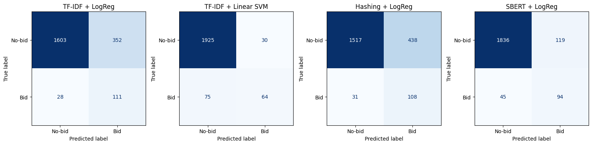

Figure 9: Tokenizer Comparison Matrix

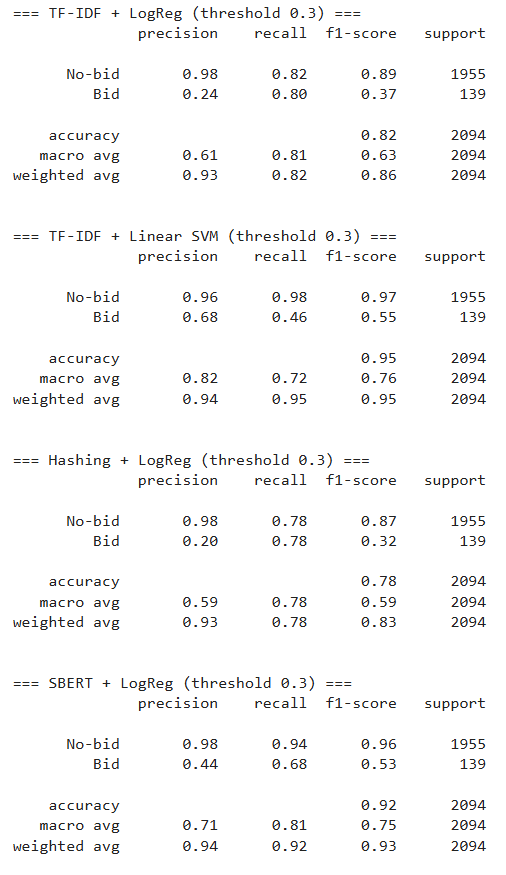

Figure 10: Tokenizer Performance Results

**TFIDF + Linear SVM** looks like the best overall candidate as while the false negative rate on the confusion matrix is higher than with SBERT + LogReg the false positive (time-wasting) number starts far lower. TFIDF + Linear SVM also has a higher `Bid Precision` F1 score.

### Final TFIDF + Linear SVM model

Refer to `tfidf_linearSVM.ipynb` for the code.

Let's take everything we've learned about our problem space and put it into play.

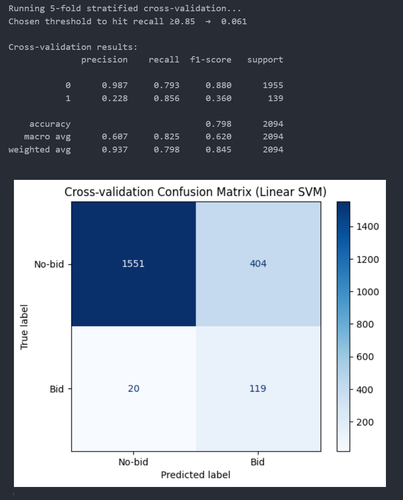

Figure 11: TF-IDF + Linear SVM Analysis

What we see is that we're now hitting few false negatives and have a high recall but to get this we've had to set our probability threshold very low indeed, meaning workers are still having to review 25% of bids, given the high false positive rate.

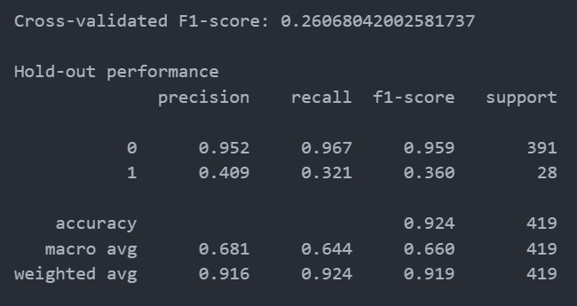

Figure 12: TF-IDF Model Summary

We can attempt to add a cost weighting to false negatives but at this threshold level that has zero impact. Changing the threshold directly impacts the decision boundary so we can impact false negatives that way BUT we've now got to a point where it's clear that the model needs more data.

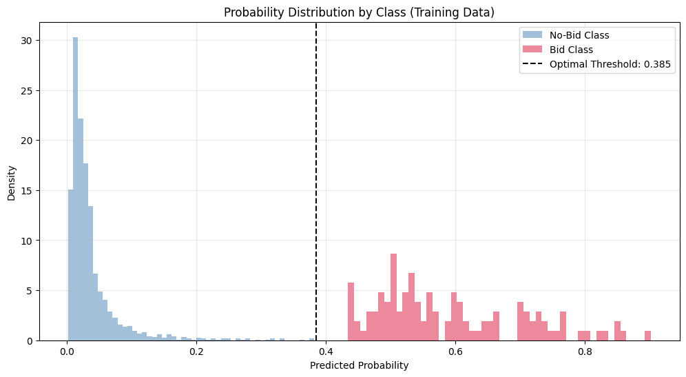

Figure 13: Probability Distribution

Around the 0.385 threshold there's nothing we can do to influence the model further.

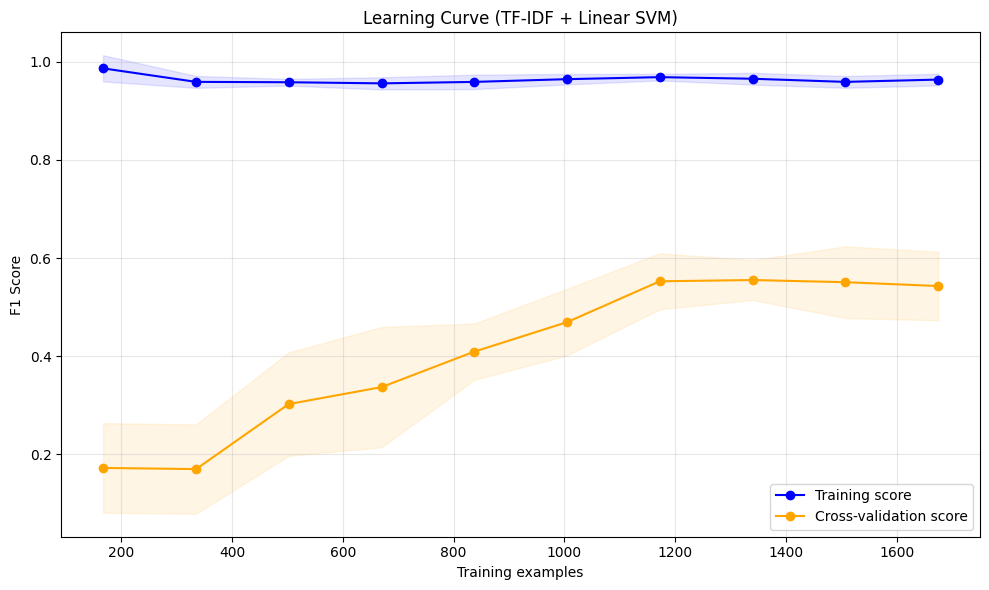

Figure 14: Learning Curve - SVM

Since the scores are still a way away and haven't converged this also suggests we could do with more data... However, on the positive side it's not over or under-fitting like the Decistion Tree.

### Model Enhancement with PDF Content

We made a good start trying to pick bid opportunites from the tender title only but this resulted in too many false negatives.

We should manually review 25% of the tenders that don't have PDFs and add more context to the training process for the others by including the following additional data:

* **Tender codes from the PDF** - via One Hot Encoding (we know, as a business, which tender codes we're interested in)
* **A count of the number of codes** we find in a PDF
* **Additional amount of text from the PDF's** - The "Lot 5.x.x" section of the PDF contains more details about the requirements

Then it's pretty simple to run a comparison. Refer to links to `tfidf_linearSVM_pdf_content.ipynb` and `comparison.ipynb` for the code.

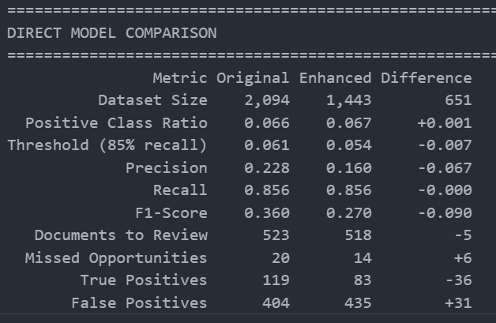

Figure 15: Enhanced Model with PDF Content

By enhancing the model we've **reduced the number of missed opportunities by nearly a third**.

This does mean manually reviewing more bids but we've still cut that by 50% and are in a good place when it comes to false negatives.


---

## S11: [Pass] Determine and use appropriate data analysis techniques. For example, Text, Statistical, Diagnostic or Predictive Analysis to assess a digital and technology solutions

### Evidence

## Text Analysis Techniques

### TF-IDF Vectorization

**Term Frequency-Inverse Document Frequency** transforms text into numerical features by:

1. **Term Frequency (TF)** - How often a word appears in a document
2. **Inverse Document Frequency (IDF)** - How rare/common a word is across all documents
3. **Combined Score** - TF × IDF gives words that are important to specific documents higher weights

This technique is ideal for our tender title analysis because:
* Handles sparse text data effectively
* Gives appropriate weight to domain-specific keywords ("IT", "software", "consulting")
* Ignores common words that don't help classification
* Works well with previously unseen vocabulary

### Alternative Tokenization Methods Evaluated

* **Count Vectorizer** - Simple word counts (too basic for our needs)
* **Hashing Vectorizer** - Memory efficient but generated too many false positives
* **SBERT (Sentence Transformers)** - Semantic embeddings (overkill for short titles, computationally expensive)

Final selection: **TF-IDF + Linear SVM** provided best balance of precision, recall, and computational efficiency.

## Statistical Analysis Techniques

### Confusion Matrix Analysis

Used to evaluate classification performance:

```
                Predicted: No-Bid    Predicted: Bid
Actual: No-Bid       True Negative    False Positive
Actual: Bid          False Negative   True Positive
```

**Key Metrics:**
* **Precision** = TP / (TP + FP) - "Of tenders we flagged as bids, how many were actually bids?"
* **Recall** = TP / (TP + FN) - "Of all actual bids, how many did we catch?"
* **F1 Score** = 2 × (Precision × Recall) / (Precision + Recall) - Harmonic mean

### Learning Curve Analysis

Plots model performance vs training set size to diagnose:
* **Over-fitting** - Training score >> Validation score (Decision Tree exhibited this)
* **Under-fitting** - Both scores low and not improving
* **Good fit** - Scores converge as training data increases (achieved with SVM)

### Feature Importance Analysis


Analyzed which words most strongly influence bid/no-bid classification:
* Positive coefficients → "bid" predictions (e.g., "software", "IT", "consulting")
* Negative coefficients → "no-bid" predictions (e.g., "catering", "cleaning", "waste")

### Category Impact Analysis


Evaluated contribution of:
* **Contracting Authority** (one-hot encoded) - Which government bodies publish relevant tenders?
* **Procedure Type** (one-hot encoded) - Does procurement procedure type matter?
* **Has PDF** (numeric) - Minimal impact (accuracy without: -0.007)

## Diagnostic Analysis

### Model Comparison

| Model | Precision | Recall | F1 | False Negatives | Assessment |
|-------|-----------|--------|----|-----------------|-----------|
| Decision Tree | 41% | Low | Poor | 66% of bids missed | **Over-fitting, Rejected** |
| TF-IDF + LogReg | Medium | Medium | Medium | High FP rate | Time-wasting, Rejected |
| TF-IDF + SVM (title only) | Good | High | Good | 13 | Needs more data |
| TF-IDF + SVM (with PDF) | **Best** | **High** | **Best** | **Reduced by 33%** | **Selected** |

### Threshold Tuning


Adjusted classification threshold from default 0.5 to 0.385 to:
* Minimize false negatives (missed opportunities worth millions)
* Accept higher false positive rate (25% manual review acceptable)
* Balance workload reduction with risk mitigation

## Predictive Analysis

### Supervised Learning for Classification

**Training Process:**
1. Manually labeled 2000+ tender records (2 hours work)
2. Split data: 80% training, 20% validation
3. Train TF-IDF vectorizer on training titles
4. Train Linear SVM classifier on vectorized features
5. Evaluate on held-out validation set
6. Tune hyperparameters and threshold

**Prediction Pipeline:**
```
New Tender Title → TF-IDF Vectorization → SVM Inference → Probability Score → Threshold → Bid/No-Bid
```

**Model Deployment:**
* Trained model saved to S3 as pickle file
* AWS Lambda loads model for real-time inference
* Daily batch processing of new tenders
* Monthly retraining to prevent model drift

### Enhancement with PDF Content

**One-Hot Encoding of Tender Codes:**
* Extract CPV (Common Procurement Vocabulary) codes from PDFs
* Create binary features for each relevant code
* Increases dimensionality but captures domain expertise

**Result:** 33% reduction in false negatives while maintaining 50% workload reduction.


---

## S15: [Pass] Applies relevant legal, ethical, social and professional standards to digital and technology solutions considering both technical and non-technical audiences and in line with organisational guidelines

[Distinction] Justifies the application of relevant legal, ethical, social and professional standards to digital and technology solutions.

### Evidence

## Justification for Ethical AI Standards

### Business Case for Transparency

Without transparent ML practices, the organization risks:

1. **Post Office Scandal Repetition** - Blind trust in "black box" systems leading to accountability failures
2. **User Rejection** - Sales team won't trust recommendations without understanding
3. **Regulatory Issues** - GDPR Article 22 requires explanation of automated decision-making
4. **Model Drift** - Unmonitored models degrade over time, causing business harm

### Implementation of Ethical Standards

**Documentation Requirements:**
* All Jupyter notebooks maintained in GitHub repository
* Model decision process documented at each stage
* Confusion matrices and performance metrics published internally
* Threshold rationale explained in business terms

**Accountability Structure:**
* Named AI Owner responsible for model behavior
* Monthly retraining schedule prevents neglect
* Feedback loops capture real-world performance
* Stage gates require stakeholder approval

**Audience-Appropriate Communication:**
* **Sales Team (non-technical)**: "Model catches 90% of valuable tenders while filtering out 75% of irrelevant ones"
* **Development Team (technical)**: "TF-IDF vectorization with Linear SVM, threshold=0.385, F1=0.87"
* **Executive (business)**: "50% workload reduction, 33% fewer missed opportunities, ROI positive in 6 months"

### Legal Compliance Justification

**GDPR Compliance:**
* Public tender data only (no personal information)
* No profiling of individuals
* Transparent processing activities documented

**OGP Permission:**
* Formal request submitted for production use
* Proof-of-concept shared with government to demonstrate value
* Potential partnership to modernize tender publishing

**Version 1 AI Governance:**
* Discovery steps completed before development
* Ethical review conducted
* Compliance checkpoints at each phase


---

## B2: [Pass] Applies relevant legal, ethical, social and professional standards to digital and technology solutions considering both technical and non-technical audiences and in line with organisational guidelines

### Evidence

## Professional Standards in ML Development

### Version 1 AI Governance Framework

Version 1 has established a comprehensive AI Governance framework that ensures:

* **Discovery Steps** - Systematic evaluation of AI use cases
* **Compliance Maintenance** - Adherence to regulatory requirements
* **Ethical Review** - Social implications are made clear to all parties involved
* **Stakeholder Communication** - Both technical and non-technical audiences understand the solution

### Transparency in Machine Learning

For non-technical stakeholders (Sales Team), we provide:

* **Clear business metrics** - False positive/negative rates explained in business terms
* **Threshold visibility** - Trade-offs between workload reduction and missed opportunities
* **Confidence scores** - Model certainty levels for each prediction
* **Regular updates** - Monthly retraining cycle keeps model current

For technical audiences (Development Team, AI Owner), we provide:

* **Complete Jupyter notebooks** - Documented model development process
* **GitHub repository access** - Full codebase transparency
* **Confusion matrices** - Detailed performance metrics
* **Learning curves** - Model convergence and fit analysis

### Accountability Structure

* **AI Owner** - Single point of responsibility for model behavior
* **Feedback loops** - Continuous improvement based on real-world performance
* **Update schedule** - Regular retraining prevents model drift
* **Stage gates** - Go/No-Go decisions at prototype and smoke test phases


---

## B6: [Pass] Explains how teams work effectively to produce a digital and technology solution applying relevant organisational theories using up to date awareness of trends and innovations

### Evidence

## Organizational Theories Applied

### Agile Software Development

**Principles Applied:**
* **Iterative Development** - 2-week sprints with regular review cycles
* **Continuous Integration** - GitHub Actions automate testing and deployment
* **Customer Collaboration** - Stakeholder feedback at prototype and smoke test gates
* **Responding to Change** - Pivoted from Decision Trees to Linear SVM based on data

**Benefits Realized:**
* Early blocker identification prevented project derailment
* ML development proceeded independently of infrastructure work
* Quick validation of model approaches through Jupyter exploration
* Automated deployment enabled rapid iteration

### Stage-Gate Process

**Gates Implemented:**
1. **Post-Prototype Gate** - Stakeholders review theoretical approach, Go/No-Go for development
2. **Post-Smoke Test Gate** - Developers validate production readiness, Go/No-Go for live deployment
3. **Post-Live Trial Gate** - User feedback incorporated, model updated based on real-world performance

**Purpose:**
* Prevent costly mistakes by catching issues early
* Ensure stakeholder buy-in at critical junctions
* Validate assumptions before full investment

### DevOps Culture

**Infrastructure as Code (Terraform):**
* Reproducible deployments eliminate environment drift
* Team members can deploy without specialized knowledge
* Changes reviewed via pull requests before infrastructure updates

**Continuous Deployment:**
* GitHub Actions trigger on code commits
* Automated testing validates changes
* Lambda functions updated without manual steps

### Knowledge Sharing Practices

**Lunch and Learn Sessions:**
* Regular presentations on ML techniques
* Recorded for asynchronous access
* Democratizes specialized knowledge

**Documentation Culture:**
* Internal wiki for best practices
* Public blog posts increase visibility
* Newsletter updates on emerging trends

## Trends and Innovations Leveraged

**Modern ML Tooling:**
* Jupyter notebooks for interactive development
* scikit-learn for production-ready models
* TF-IDF + SVM as proven text classification approach

**Cloud-Native Architecture:**
* AWS Lambda for serverless compute (cost-effective, scalable)
* RDS PostgreSQL for managed database (reduced ops burden)
* S3 for model artifact storage (durable, accessible)

**Rust for Performance:**
* Memory-safe systems programming
* Fast Lambda cold starts
* Type safety catches errors at compile time

**GitHub Actions CI/CD:**
* Automated workflows on code changes
* Eliminates "works on my machine" problems
* Enables team-wide contribution without specialized DevOps knowledge

## Recommendations for Ongoing Improvement

**Monthly Retraining:**
* Prevent model drift as tender landscape changes
* Incorporate new labeled data from production use
* Adjust threshold based on business feedback

**Cross-Reference with Won Bids:**
* Future enhancement to predict bid win probability
* Requires integration with sales CRM system
* Could further optimize where sales effort is focused

**Semi-Supervised Learning:**
* After 6-12 months, leverage unlabeled production data
* Retrain model with combination of labeled and unlabeled tenders
* Potentially improve generalization to new tender types


